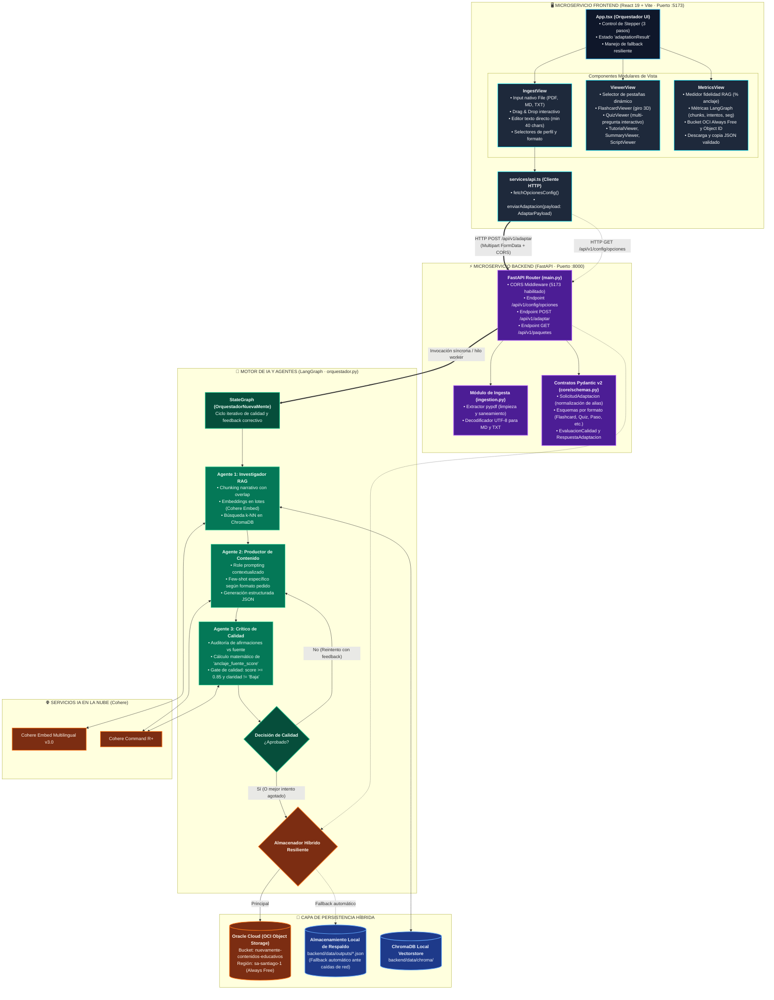
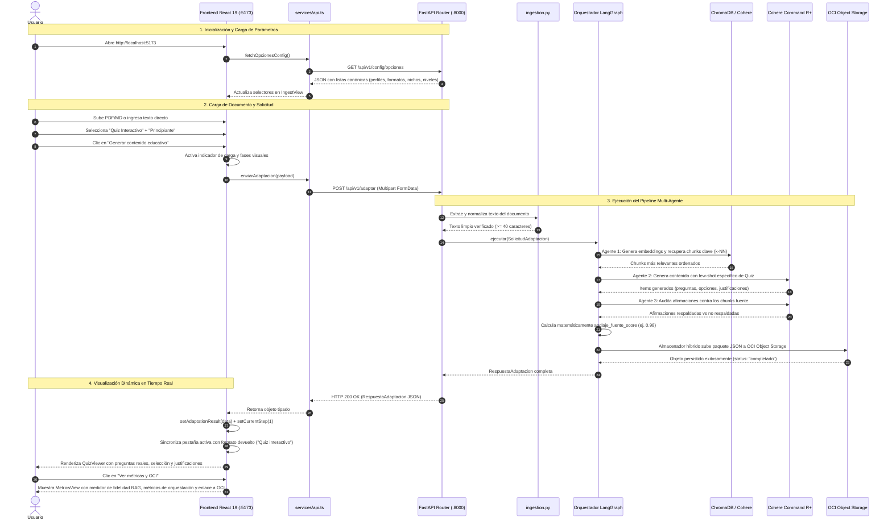

# 🧩 Esquema de Integración Full-Stack: Frontend (React 19) + Backend (FastAPI + LangGraph)

> **Proyecto:** NuevaMente — Sistema Inteligente de Adaptación Pedagógica  
> **Arquitectura:** Microservicios Desacoplados con Comunicación Asíncrona REST / Multipart  
> **Fecha:** Septiembre de 2026  
> **Rama de Referencia:** `integracion`  

---

## 🏛️ 1. Diagrama de Arquitectura de Integración (Componentes y Flujo de Datos)



---

## 🔄 2. Diagrama de Secuencia End-to-End: Ciclo de Vida de una Adaptación

El siguiente diagrama detalla la interacción paso a paso desde que el usuario interactúa con la interfaz web hasta que se visualiza el contenido pedagógico auditado:



---

## 📊 3. Matriz de Contratos de Datos (Mapeo TypeScript ↔ Pydantic v2)

| Concepto | Tipo Frontend (`frontend/src/types/api.ts`) | Esquema Backend (`backend/app/core/schemas.py`) | Función en el Sistema |
|---|---|---|---|
| **Opciones Canónicas** | `ConfigOpciones` | `obtener_opciones_configuracion()` | Rellena los selectores de `IngestView` evitando valores inválidos. |
| **Payload de Ingesta** | `AdaptarPayload` (FormData) | `SolicitudAdaptacion` | Transfiere el archivo o texto directo con los 4 parámetros pedagógicos. |
| **Flashcard Item** | `FlashcardItem` (`frente`, `dorso`, `pista_didactica`) | `ItemFlashcard` | Alimenta el visor 3D interactivo con anclaje a fuentes. |
| **Quiz Item** | `QuizItem` (`pregunta`, `opciones[]`, `respuesta_correcta`, `justificacion`) | `ItemQuiz` | Alimenta el cuestionario interactivo multi-pregunta con retroalimentación inmediata. |
| **Tutorial Item** | `TutorialItem` (`numero_paso`, `titulo`, `instruccion`) | `ItemPaso` | Alimenta la guía práctica con checklist interactivo paso a paso. |
| **Resumen Item** | `SummaryItem` (`punto`, `por_que_importa`) | `ItemResumen` | Alimenta la síntesis ejecutiva rápida de lectura en 60 segundos. |
| **Guion Item** | `ScriptItem` (`minuto_aproximado`, `narracion`, `apoyo_visual_sugerido`) | `ItemSegmentoGuion` | Alimenta el guion técnico audiovisual con marcas de tiempo. |
| **Métricas de Auditoría** | `EvaluacionCalidad` (`anclaje_fuente_score`, `claridad_pedagogica`, `observaciones`) | `EvaluacionCalidad` | Muestra el porcentaje de anclaje RAG (Zero Hallucination) calculado en código. |
| **Persistencia Cloud** | `AlmacenamientoOCI` (`bucket`, `objeto_id`, `status_upload`) | `AlmacenamientoOCI` | Muestra el estado del bucket OCI Always Free y el identificador de descarga. |
| **Métricas LangGraph** | `MetricasOrquestacion` (`chunks_recuperados`, `intentos_redaccion`, `duracion_segundos`) | `MetricasOrquestacion` | Expone la telemetría operativa del ciclo iterativo de los agentes. |

---

## 🛡️ 4. Estrategia de Resiliencia y Fallback Dual

El sistema está diseñado para nunca interrumpir el aprendizaje del estudiante ante fallos de conectividad o infraestructura:

```text
                               ┌──────────────────────────────────────────────┐
                               │  Llamada HTTP a POST /api/v1/adaptar         │
                               └──────────────────────┬───────────────────────┘
                                                      │
                                    ¿Backend FastAPI responde?
                                     /                       \
                                  SÍ                          NO
                                 /                              \
        ┌──────────────────────────────────┐        ┌──────────────────────────────────┐
        │ Procesa respuesta dinámica real  │        │ Conmuta a modo demostrativo     │
        │ y renderiza los items del LLM    │        │ canónico con banner no bloqueante│
        └────────────────┬─────────────────┘        └──────────────────────────────────┘
                         │
         ¿OCI Object Storage disponible?
          /                             \
        SÍ                               NO
       /                                   \
┌──────────────────────────────┐    ┌──────────────────────────────┐
│ Sube a bucket OCI Santiago   │    │ Guarda automáticamente en    │
│ (nuevamente-contenidos-...)  │    │ data/outputs/ local          │
└──────────────────────────────┘    └──────────────────────────────┘
```

1. **Fallback de Backend a Frontend:** Si el backend estuviera apagado durante una revisión de UI, `App.tsx` captura la excepción, despliega un aviso informativo discreto y carga los datos canónicos de respaldo (`MOCK_RESPUESTA_ADAPTACION`).
2. **Fallback de Persistencia en Backend:** Si OCI Object Storage presenta indisponibilidad de credenciales o red, el orquestador conmuta en 0 milisegundos a `local_storage.py` en `backend/data/outputs/` sin lanzar errores al usuario.

---

## 🚀 5. Mapeo de Puertos y Puntos de Acceso

| Servicio | Tecnología | URL Local | Descripción |
|---|---|---|---|
| **Frontend Web** | React 19 + Vite 8 | `http://localhost:5173` | Interfaz SPA completa con GSAP, Lenis y diseño pedagógico. |
| **Backend API** | FastAPI + Uvicorn | `http://127.0.0.1:8000` | Servidor REST con orquestación LangGraph y ChromaDB. |
| **Swagger UI** | OpenAPI 3.1 | `http://127.0.0.1:8000/docs` | Documentación interactiva de todos los endpoints de la API. |
| **Base Vectorial** | ChromaDB Local | `backend/data/chroma/` | Persistencia vectorial de fragmentos indexados. |
| **Object Storage** | OCI Cloud | Bucket `nuevamente-contenidos-educativos` | Persistencia en la nube Always Free en la región `sa-santiago-1`. |
