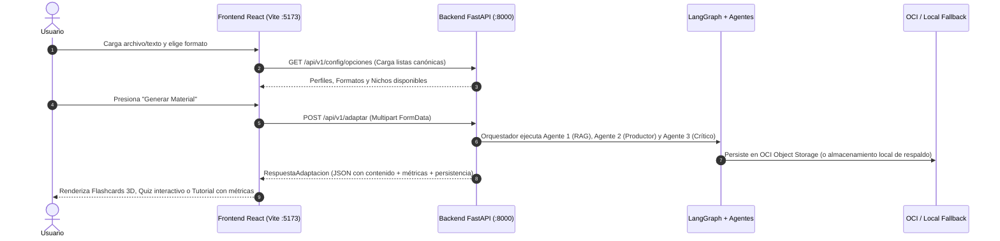

# 🚀 Informe Técnico: Integración Full-Stack de NuevaMente (Rama `integracion`)

> **Destinatarios:** Equipo de Desarrollo, Evaluadores Técnicos y Jurado del Hackathon ONE G10  
> **Proyecto:** NuevaMente — Sistema Inteligente de Adaptación Pedagógica con Agentes de IA  
> **Fecha:** Septiembre de 2026  
> **Rama de Trabajo:** `integracion`  
> **Estado:** ✅ Integración 100% Completa, Compilada y Verificada

---

## 🎯 1. ¿Qué es este documento y qué acabamos de hacer?

Este informe explica de manera clara y accesible qué acciones se llevaron a cabo para unir **en una sola rama unificada (`integracion`)** las dos piezas fundamentales de **NuevaMente**:

1. **El Microservicio Backend (FastAPI + LangGraph + Cohere + ChromaDB + OCI):** El motor inteligente que valida, investiga en bases vectoriales, redacta contenido pedagógico y evalúa rigurosamente su anclaje a las fuentes.
2. **El Microservicio Frontend (React 19 + Vite + TypeScript + GSAP + Lenis):** La interfaz de usuario moderna, fluida y visualmente atractiva desarrollada por el equipo de diseño y frontend en la rama `origin/frontEnd`.

---

## 🔍 2. El Desafío: ¿Por qué no podíamos hacer un simple `git merge`?

Cuando el equipo de frontend desarrolló la interfaz web en la rama remota `origin/frontEnd`, partió de una versión antigua del repositorio (`origin/main`). 

Al inspeccionar los cambios de esa rama, descubrimos algo crítico:
* La rama `origin/frontEnd` **había eliminado por completo la carpeta `backend/`**, los scripts de base de datos y la documentación técnica.
* Si hubiéramos ejecutado un comando estándar `git merge origin/frontEnd`, Git habría eliminado todo el motor de agentes y los 65 tests de backend o habría desatado decenas de conflictos de fusión destructivos.

### 💡 La Solución Estratégica Implementada:
Para garantizar que **no se perdiera ni una sola línea de código funcional**, se procedió con una técnica de integración quirúrgica:
1. **Creamos una nueva rama limpia** llamada **`integracion`** partiendo del estado más estable y probado del backend (`HEAD -> backend`).
2. **Importamos de forma selectiva** únicamente la carpeta `frontend/` desde `origin/frontEnd` (`git checkout remotes/origin/frontEnd -- frontend/`).
3. Sustituimos la interfaz provisional basada en Streamlit por la suite oficial de **React + Vite**, manteniendo intacto el 100% de la lógica de agentes, persistencia OCI y pruebas del backend.

---

## 🎨 3. ¿Cómo está compuesta la nueva aplicación Frontend?

La interfaz de usuario en `frontend/` es una Single Page Application (SPA) construida con tecnologías web de última generación:

### Tecnologías Clave:
* **React 19 & TypeScript:** Tipado estricto que asegura sincronía total con los contratos JSON de FastAPI.
* **Vite 8:** Empaquetador ultrarrápido con Hot Module Replacement (HMR).
* **GSAP & Lenis:** Animaciones de transición y scroll fluido de alta precisión.
* **Lucide React:** Iconografía vectorial estilizada y consistente.
* **CSS Modules & Design Tokens:** Sistema de diseño con temas oscuros, brillos ambientales y paletas de color pedagógicas.

### Arquitectura de Vistas (3 Pasos Consecutivos):
1. **Paso 1: `IngestView` (Configuración e Ingesta):**
   * Zona de carga drag & drop para documentos técnicos (**PDF, Markdown y TXT**).
   * Selector canónico de **Perfiles Pedagógicos** (Principiante, Junior, Líder Técnico, Gestor).
   * Selector de **Formatos Educativos** (Flashcards, Quiz, Tutorial, Resumen, Guion).
   * Filtros de nicho (General, Fintech, Salud, E-commerce) y niveles de detalle (Didáctico, Intermedio, Profundo).
2. **Paso 2: `ViewerView` (Visualización Dinámica de Contenidos):**
   * **`FlashcardViewer`:** Tarjetas interactivas con giro tridimensional (3D Flip Effect) en CSS, pistas didácticas y navegación entre cartas.
   * **`QuizViewer`:** Evaluación interactiva paso a paso con retroalimentación inmediata, selección de opciones y justificaciones pedagógicas al vuelo.
   * **`TutorialViewer`:** Guía técnica estructurada con bloques de código, requisitos previos y pasos numerados.
   * **`SummaryViewer`:** Resumen ejecutivo de lectura rápida con conceptos clave y conclusiones prácticas.
   * **`ScriptViewer`:** Guion técnico audiovisual organizado por marcas de tiempo (timestamps) y notas de apoyo visual.
3. **Paso 3: `MetricsView` (Auditoría de Calidad y Cloud OCI):**
   * Indicador del **Score de Anclaje a las Fuentes** (ej. 98% de fidelidad).
   * Nivel de **Claridad Pedagógica** asignado por el Agente Crítico.
   * Estado de persistencia en la nube (**Oracle Cloud Infrastructure - OCI Object Storage**) con el nombre del bucket y el ID de objeto generado.
   * Visor y descargador del JSON completo normalizado.

---

## 🔌 4. ¿Cómo se comunican el Frontend y el Backend?

La comunicación se encuentra encapsulada en el servicio `frontend/src/services/api.ts`:



* **Respaldo Inteligente (Mock Fallback):** Si el backend se encontrara temporalmente apagado, el servicio del frontend cuenta con un mock de demostración canónico que permite evaluar y presentar la interfaz sin caídas bruscas.

---

## 🛠️ 5. Sincronización de Scripts y Archivos del Repositorio

Para que cualquier persona pueda ejecutar el proyecto sin complicaciones en Windows:

1. **`iniciar_local.bat` Actualizado:**
   * Al hacer doble clic en `iniciar_local.bat`, se abren automáticamente dos terminales independientes:
     * **Terminal 1:** Servidor FastAPI en `http://127.0.0.1:8000`.
     * **Terminal 2:** Servidor Vite (React) en `http://localhost:5173`.
   * El navegador se abre directamente en `http://localhost:5173`.
2. **`.gitignore` Endurecido:**
   * Se añadieron reglas a nivel raíz para ignorar `node_modules/`, `dist/` y `dist-ssr/`, protegiendo el repositorio contra artefactos pesados.
3. **`README.md` Sincronizado:**
   * Se actualizó el diagrama arquitectónico Mermaid y el árbol de carpetas con el detalle de `frontend/src/`, `backend/docs/`, `deploy/` y `scripts/`.

---

## 🧪 6. Resultados de las Pruebas de Verificación

Tras culminar la integración, se realizaron pruebas automatizadas de extremo a extremo:

| Componente | Prueba Ejecutada | Resultado |
|---|---|:---:|
| **Frontend** | `npm run build` (`tsc -b && vite build`) | ✅ **100% Exitoso** (Construido en 1.21s, 0 errores) |
| **Backend** | `pytest backend/tests -v` | ✅ **65 de 65 tests pasando** (100% de éxito en 13.2s) |
| **Repositorio Git** | `git status` en rama `integracion` | ✅ **Limpio (Working tree clean)** |

---

## 🚀 7. Instrucciones Rápidas para Ejecutar en Local

1. **Requisitos:**
   * Python 3.12.7 instalado.
   * Node.js v18+ y npm instalados.
2. **Instalación de dependencias (solo la primera vez):**
   ```powershell
   # Dependencias de Python
   .\setup.bat

   # Dependencias del Frontend
   cd frontend
   npm.cmd install
   cd ..
   ```
3. **Iniciar todo el sistema:**
   ```powershell
   .\iniciar_local.bat
   ```
4. **URLs de Acceso:**
   * 🖥️ **Aplicación Web (React + Vite):** [http://localhost:5173](http://localhost:5173)
   * ⚙️ **API REST (FastAPI):** [http://127.0.0.1:8000](http://127.0.0.1:8000)
   * 📖 **Documentación Swagger / OpenAPI:** [http://127.0.0.1:8000/docs](http://127.0.0.1:8000/docs)
