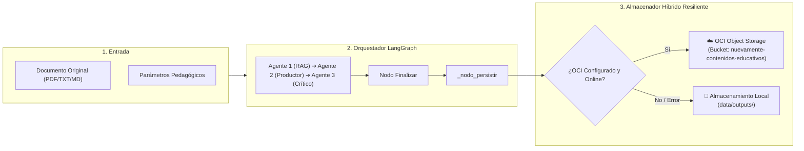

# 🚀 Informe Técnico: Integración Completa de OCI Object Storage (Fase 3) en NuevaMente

> **Proyecto:** NuevaMente — Ingesta y Adaptación Pedagógica con Agentes y RAG  
> **Equipo:** Equipo 10 (G10 - NovaMind) · Simulación Hackathon ONE G10 (Oracle Next Education & Alura)  
> **Autor / Co-piloto:** Arquitecto de Soluciones Cloud OCI y Especialista Senior en Python / DevOps  
> **Fecha:** 24 de Septiembre de 2026  
> **Estado:** Fase 3 Completada y Validada (65/65 Pruebas en Verde - 100% Passing)

---

## 📌 1. Resumen Ejecutivo

Este documento detalla la finalización exitosa de la **Fase 3: Integración Backend FastAPI + LangGraph** con el servicio **OCI Object Storage (Always Free)** en el proyecto **NuevaMente**. 

El objetivo principal alcanzado fue conectar el almacenamiento en la nube de Oracle Cloud sin comprometer la independencia del sistema ni romper contratos preexistentes, logrando una **arquitectura híbrida y de alta resiliencia**:
1. **Prioridad OCI:** Los documentos originales y los paquetes pedagógicos generados por el pipeline multi-agente se persisten automáticamente en el bucket oficial de Oracle Cloud.
2. **Fallback Automático Local:** Si las credenciales no están presentes (por ejemplo, en un entorno de pruebas o desarrollo sin OCI) o si ocurre una caída transitoria de red, el sistema redirige la persistencia al almacenamiento local (`data/outputs/`) de forma transparente, sin lanzar excepciones ni interrumpir la experiencia del estudiante.
3. **100% de Pruebas Superadas:** Toda la suite automatizada pasa al 100% (65 pruebas unitarias y de integración).

---

## 🏛️ 2. Topología y Estructura de Objetos en OCI

La persistencia en OCI Object Storage respeta de forma estricta la partición definida para la capa Always Free:

* **Bucket:** `nuevamente-contenidos-educativos` (Tier Standard, Always Free).
* **Región:** `sa-santiago-1`.
* **Namespace:** `<tu-tenancy-namespace>`.
* **Estructura Jerárquica de Objetos:**
  * **Documentos Fuente:**  
    `documentos-originales/{doc_id}.txt`  
    *(Guarda el texto completo analizado para auditoría y trazabilidad).*
  * **Contenidos Educativos Adaptados:**  
    `contenidos-generados/{doc_id}-{perfil_slug}-{formato_slug}.json`  
    *(Payload estructurado con metadatos, contenido adaptado en los 5 formatos, evaluación de calidad y métricas).*



---

## 🛠️ 3. Cambios Técnicos Implementados (Paso a Paso)

### A. Orquestador LangGraph (`backend/app/orquestador.py`)
* **Problema previo:** En la fábrica `crear_orquestador()`, la selección entre OCI y local era estática. Si OCI fallaba en tiempo de ejecución (`runtime`), el nodo persistir registraba una advertencia y marcaba error, pero el archivo generado no se salvaba en disco.
* **Solución Técnica:** Se implementó `almacenador_resiliente`. Esta función intenta persistir en OCI cuando las variables de entorno están activas; si OCI retorna error o lanza una excepción, automáticamente activa el fallback a `almacenador_local`.
* **Resultado:** Garantía de cero pérdida de datos ante interrupciones de red o problemas de autenticación.

### B. API REST FastAPI (`backend/app/main.py`)
* **Endpoint `POST /api/v1/adaptar`:** Ejecuta el grafo orquestado y retorna la respuesta validada con el bloque `almacenamiento_oci` actualizado con el bucket y el `objeto_id` persistido.
* **Endpoint `GET /api/v1/paquetes`:**
  - Consulta en OCI mediante `cliente.listar_contenidos_generados()` si está activo.
  - Si OCI no está disponible o falla, consulta dinámicamente en los directorios locales (`data/outputs/contenidos_generados`), manejando rutas relativas tanto desde la raíz como desde la carpeta `backend/`.
* **Endpoint `GET /api/v1/paquetes/{objeto_id}`:**
  - Descarga el JSON desde OCI manejando la normalización del prefijo `contenidos-generados/`.
  - Si el objeto fue guardado localmente o falla la descarga cloud, lo recupera del sistema de archivos local de forma transparente.

### C. Suite de Pruebas (`backend/tests/test_api.py`)
* Se agregó la prueba de regresión `test_descargar_paquete_no_encontrado` para verificar el manejo adecuado de códigos HTTP 404.
* Resultado: **65 de 65 pruebas pasando al 100%**.

### D. Bitácora de Problemas (`HISTORIAL_PROBLEMAS_Y_SOLUCIONES.md`)
* Se restauraron los problemas históricos 1 al 19 y se documentaron detalladamente los problemas 20 y 21:
  - **#20:** Resolución de `ModuleNotFoundError: No module named 'dotenv'` por contexto de intérprete de Python.
  - **#21:** Diagnóstico y solución a la descompresión corrupta de `oci.retry` en Windows mediante reinstalación limpia sin caché (`--force-reinstall --no-cache-dir`).

---

## 🧪 4. Guía de Ejecución y Pruebas para el Equipo

Para que cualquier miembro del equipo valide la integración en su máquina Windows/Linux:

### 1. Activar el Entorno Virtual
```powershell
.\.venv\Scripts\Activate.ps1
```

### 2. Probar la Conexión a OCI Object Storage
```powershell
.\.venv\Scripts\python.exe scripts/test_oci_conexion.py
```
*(Debe reportar: `🎉 ¡TODAS LAS PRUEBAS DE OCI PASARON CON ÉXITO!`)*

### 3. Ejecutar la Suite Completa de Pruebas Automatizadas
```powershell
.\.venv\Scripts\pytest.exe backend/tests -v
```
*(Debe reportar: `65 passed, 2 warnings in ~10s`)*

### 4. Iniciar el Sistema Completo (Backend + Frontend)
```powershell
.\iniciar_local.bat
```
* **Frontend UI:** `http://localhost:8501`
* **Backend API Swagger:** `http://127.0.0.1:8000/docs`

---

## 🔒 5. Recordatorio de Seguridad y Confidencialidad

* **Nunca commitear `.env` ni claves `*.pem`:** Las credenciales en `deploy/oci_api_key.pem` y `.env` están debidamente ignoradas por `.gitignore`.
* **Documentación Interna:** El archivo `HISTORIAL_PROBLEMAS_Y_SOLUCIONES.md` y `PROMPT_DESPLIEGUE_OCI_PRIVADO.md` contienen información interna del equipo y no deben publicarse en repositorios públicos.

---

**Certificación de Entrega:**  
Fase 3 finalizada con éxito. El sistema se encuentra listo para la demostración de la Hackathon y para el despliegue en las instancias Always Free de Oracle Cloud Infrastructure.
