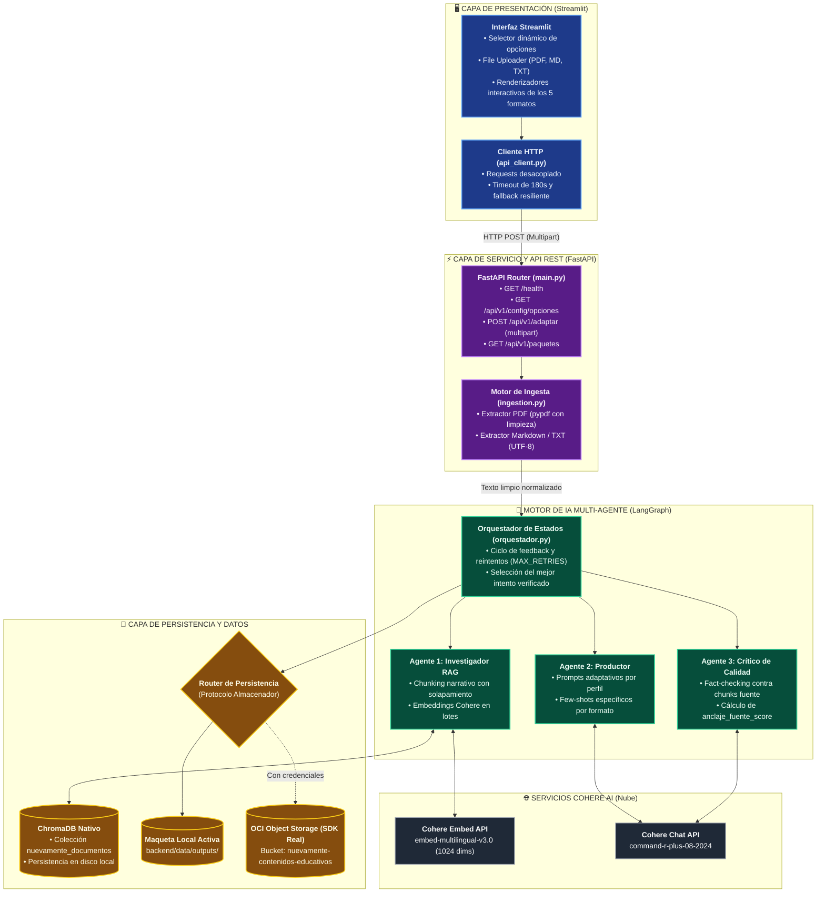
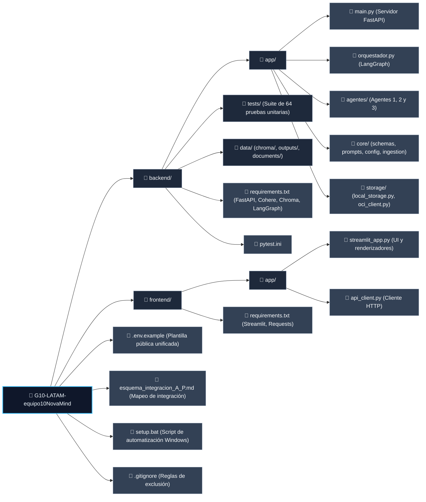
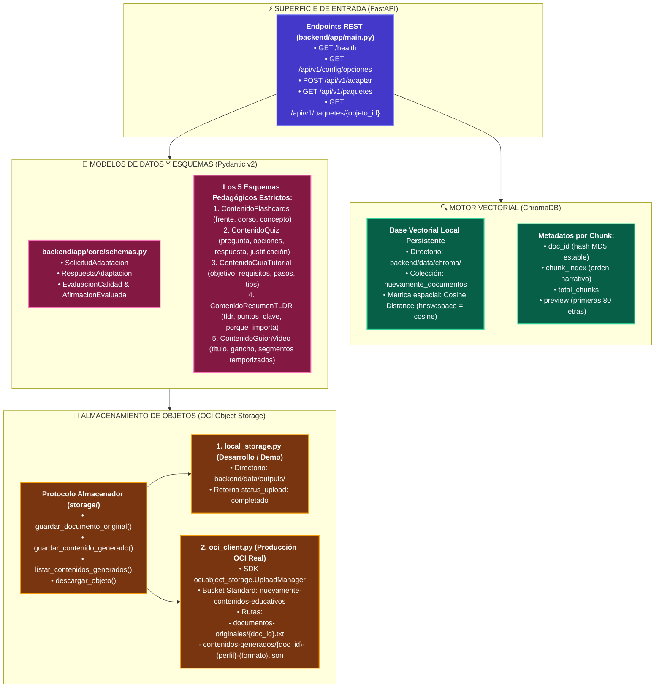

# 🧠 NuevaMente — Sistema Inteligente de Adaptación y Generación de Contenido Educativo

> **Desarrollado por el Equipo 10 (G10 - NovaMind) para No-Country**  
> **Hackathon ONE G10 · Oracle Next Education & Alura · Proyecto 1**  
> Solución integral desacoplada en **Microservicios (Backend FastAPI + Frontend Streamlit)** con orquestación multi-agente en **LangGraph**, **RAG vectorial con Cohere**, **ChromaDB**, y persistencia modular.

---

## 📖 Visión General del Proyecto

**NuevaMente** es una plataforma diseñada para democratizar y personalizar el aprendizaje técnico. Transforma documentos complejos (manuales de ingeniería, guías de arquitectura, documentación de APIs) en **5 formatos pedagógicos adaptados** al perfil del estudiante, nivel de profundidad y sector laboral.

### La Fusión Arquitectónica (Alejandro + Pedro)
Este sistema consolida la integración técnica de dos líneas de trabajo del equipo:
1. **Infraestructura y Despliegue (Alejandro)**: Arquitectura de microservicios reales desacoplados, servidor web REST en FastAPI, ingesta multi-formato (PDF con extracción limpia, Markdown, TXT), cliente SDK de OCI Object Storage y despliegue modular de bajo consumo.
2. **Motor de IA y Agentes (Pedro)**: Grafo cíclico multi-agente en LangGraph con feedback correctivo, prompting adaptativo con few-shots específicos por formato, RAG con Cohere (`command-r-plus` y `embed-multilingual-v3.0`), validación estricta de esquemas con Pydantic v2 y suite determinista de 64 pruebas automatizadas.

---

## 🏛️ 1. Diagrama de Arquitectura General

El sistema opera bajo un modelo cliente-servidor desacoplado mediante contratos HTTP REST:



---

## 📂 2. Diagrama de Estructura de Carpetas

La arquitectura del repositorio sigue una estricta separación de responsabilidades para aislar el frontend, la API de servicio y el motor multi-agente:



### Detalle de Carpetas y Responsabilidades Técnicas

```text
G10-LATAM-equipo10NovaMind/
├── .env.example                   # Plantilla de variables de entorno (Cohere, OCI, Chroma)
├── esquema_integracion_A_P.md     # Mapeo detallado de autorías técnicas (Alejandro vs. Pedro)
├── setup.bat                      # Script para arranque local asistido en Windows
│
├── backend/                       # MICROSERVICIO BACKEND (FastAPI + LangGraph + Agentes)
│   ├── requirements.txt           # Dependencias limpias fijadas para Python 3.12.7
│   ├── pytest.ini                 # Configuración de pytest (testpaths = tests)
│   ├── tests/                     # Suite de pruebas deterministas (64 tests pasando)
│   │   ├── test_api.py            # Validación de endpoints REST con TestClient
│   │   ├── test_orquestador.py    # Pruebas unitarias de agentes, contratos y feedback
│   │   └── test_integracion_offline.py # Pipeline E2E con dependencias simuladas
│   ├── data/                      # Directorio de persistencia
│   │   ├── chroma/                # Base vectorial nativa persistente de ChromaDB
│   │   ├── documents/             # Archivos fuente cargados para pruebas
│   │   └── outputs/               # Salidas persistidas por la maqueta de OCI
│   └── app/                       # Código de la aplicación
│       ├── main.py                # Servidor FastAPI (/health, /opciones, /adaptar, /paquetes)
│       ├── orquestador.py         # Grafo de ejecución LangGraph y control de ciclo
│       ├── agentes/               # Clases independientes de los 3 agentes pedagógicos
│       │   ├── agente1_investigador.py # Ingesta, chunking y búsqueda semántica
│       │   ├── agente2_productor.py    # Generación adaptativa con few-shots
│       │   └── agente3_critico.py      # Fact-checking y evaluación de anclaje
│       ├── core/                  # Módulos centrales de lógica de negocio
│       │   ├── schemas.py         # Modelos Pydantic v2 de los 5 formatos y validadores
│       │   ├── prompts.py         # Prompts de sistema y ejemplos estructurados
│       │   ├── config.py          # Validación de variables de entorno y fallbacks
│       │   └── ingestion.py       # Extractor multi-formato (PDF, Markdown, TXT)
│       └── storage/               # Capa de almacenamiento
│           ├── local_storage.py   # Maqueta activa (guarda en data/outputs/)
│           └── oci_client.py      # Cliente real con SDK oficial de Oracle Cloud
│
└── frontend/                      # MICROSERVICIO FRONTEND (Streamlit)
    ├── requirements.txt           # Dependencias mínimas de UI (Streamlit, Requests)
    └── app/
        ├── streamlit_app.py       # Interfaz visual con renderizadores para los 5 formatos
        └── api_client.py          # Cliente HTTP desacoplado con timeout de 180s
```

---

## 🔄 3. Diagrama de Flujo de Datos y Proceso End-to-End

El ciclo completo de transformación y auditoría pedagógica sigue una máquina de estados determinista gobernada por LangGraph:

```mermaid
sequenceDiagram
    autonumber
    actor Usuario
    participant UI as Frontend (Streamlit)
    participant API as Backend API (FastAPI)
    participant Ingestion as Ingestion Engine
    participant Orquestador as LangGraph Engine
    participant Ag1 as Agente 1 (Investigador)
    participant Chroma as ChromaDB Vector Store
    participant Ag2 as Agente 2 (Productor)
    participant Ag3 as Agente 3 (Crítico)
    participant Storage as Almacenamiento (OCI / Local)

    %% 1. ENTRADA Y VALIDACIÓN
    Usuario->>UI: Sube documento (PDF/MD/TXT) y selecciona parámetros
    Note over UI: Valida tamaño y tipo de archivo
    UI->>API: HTTP POST /api/v1/adaptar (Multipart: archivo + perfil + formato + detalle)
    API->>Ingestion: extraer_texto(archivo_bytes, extension)
    Ingestion-->>API: Texto limpio sin encabezados repetidos
    API->>Orquestador: ejecutar(DocumentoIngresado, SolicitudAdaptacion)

    %% 2. PIPELINE MULTI-AGENTE
    rect rgb(240, 253, 244)
        Note over Orquestador, Chroma: FASE 1: Ingesta y Recuperación RAG
        Orquestador->>Ag1: ingestar_documento(texto, doc_id)
        Ag1->>Ag1: Chunking narrativo con solapamiento
        Ag1->>Ag1: Generar Embeddings con Cohere (lotes <= 96)
        Ag1->>Chroma: Upsert de chunks y vectores (cosine space)
        Orquestador->>Ag1: buscar_chunks_relevantes(query, n_results)
        Ag1->>Chroma: Consulta vectorial
        Chroma-->>Ag1: Chunks de mayor similitud
        Ag1-->>Orquestador: Chunks contextuales
    end

    rect rgb(254, 243, 199)
        Note over Orquestador, Ag2: FASE 2: Producción Pedagógica
        Orquestador->>Ag2: generar_contenido(chunks, perfil, formato, detalle)
        Note over Ag2: Inyecta Few-Shot específico para el formato pedido
        Ag2->>Ag2: Llamada a Cohere Command R+ (JSON mode)
        Ag2-->>Orquestador: Borrador estructurado validado por Pydantic v2
    end

    rect rgb(254, 242, 242)
        Note over Orquestador, Ag3: FASE 3: Fact-Checking y Auditoría de Calidad
        Orquestador->>Ag3: evaluar_contenido(borrador, chunks_fuente, perfil, formato)
        Ag3->>Ag3: Audita cada afirmación individualmente contra los chunks
        Ag3->>Ag3: Calcula anclaje_fuente_score = afirmaciones_respaldadas / total
        Ag3-->>Orquestador: EvaluacionCalidad (score, veredicto, feedback correctivo)
    end

    %% 3. CONTROL DE CICLO Y DECISIÓN
    alt anclaje_fuente_score >= 0.70 Y claridad != 'Baja'
        Note over Orquestador: ✅ Calidad Aprobada al primer intento
    else Calidad insuficiente Y reintentos < MAX_RETRIES
        Note over Orquestador: 🔄 Ciclo de Feedback: Agente 3 instruye a Agente 2
        Orquestador->>Ag2: regenerar_con_feedback(feedback_critico)
        Ag2-->>Orquestador: Nuevo borrador corregido
        Orquestador->>Ag3: reevaluar_contenido(nuevo_borrador)
    else Reintentos agotados
        Note over Orquestador: ⚠️ Entrega el mejor intento con advertencia explícita
    end

    %% 4. PERSISTENCIA Y RESPUESTA
    Orquestador->>Storage: guardar_original_y_generado(doc_id, producto_json)
    Storage-->>Orquestador: Metadatos de persistencia (status_upload)
    Orquestador-->>API: RespuestaAdaptacion completa
    API-->>UI: JSON HTTP 200 (producto + metadatos + evaluacion_calidad)
    UI->>Usuario: Dibuja el formato interactivo (Flashcards, Quiz, Tutorial, TL;DR o Guion)
```

---

## 🗄️ 4. Repositorios de Base de Datos y Capa Backend

La capa Backend se compone de tres motores de almacenamiento y persistencia claramente delimitados:



---

## 🎯 5. Los 5 Formatos Pedagógicos Soportados

El sistema adapta cualquier documento técnico a **5 formatos pedagógicos especializados**, validados por esquemas Pydantic estrictos y renderizados interactivamente en la interfaz:

| Formato Pedagógico | Modelo Pydantic | Características Principales | Renderizado en Streamlit |
| :--- | :--- | :--- | :--- |
| **🗂️ Flashcards de Estudio** | `ContenidoFlashcards` | Pares de pregunta/respuesta atómicas, concepto clave y nivel de dificultad. | Tarjetas interactivas con efecto reverso y revelado con un clic. |
| **📝 Quiz Interactivo** | `ContenidoQuiz` | Preguntas de opción múltiple con 4 alternativas y justificación técnica razonada. | Botones de radio con verificación instantánea de acierto y explicación. |
| **🛠️ Guía Paso a Paso (Tutorial)** | `ContenidoGuiaTutorial` | Procedimiento secuencial ordenado con prerrequisitos, pasos de acción y advertencias. | Pasos numerados con tarjetas de advertencia (*tips / caveats*). |
| **📋 Resumen Ejecutivo (TL;DR)** | `ContenidoResumenTLDR` | Síntesis concisa de alto impacto con análisis de *¿por qué le importa al destinatario?*. | Métricas clave en tarjetas expansibles y llamado a la acción. |
| **🎬 Guion de Clase / Video** | `ContenidoGuionVideo` | Guion estructurado por minutos con gancho inicial, contenido central y apoyos visuales. | Bloques temporizados con indicador de tiempo estimado y notas de pantalla. |

---

## 🚀 6. Guía de Puesta en Marcha Local

### Requisitos Previos
- **Python 3.12.7** (versión oficial estandarizada del proyecto).
- **API Key de Cohere**: Regístrate y obtén tu clave en [cohere.com](https://cohere.com).

### Paso 1: Configurar Variables de Entorno
Copia la plantilla `.env.example` tanto en la raíz como en `backend/`:
```bash
cp .env.example backend/.env
```
Edita `backend/.env` y configura tu API Key:
```env
COHERE_API_KEY=tu_api_key_de_cohere
COHERE_MODEL=command-r-plus-08-2024
EMBEDDING_MODEL=embed-multilingual-v3.0
```

### Paso 2: Crear el Entorno Virtual e Instalar Dependencias
```bash
# Crear el entorno virtual en la raíz
python -m venv .venv

# Activar en Windows
.venv\Scripts\activate

# Activar en Linux/macOS
source .venv/bin/activate

# Instalar dependencias completas
pip install -r backend/requirements.txt
pip install -r frontend/requirements.txt
```

### Paso 3: Ejecución de Servicios

#### Terminal 1 — Iniciar el Backend (FastAPI):
```bash
cd backend
uvicorn app.main:app --reload --port 8000
```
* Swagger interactivo: [http://localhost:8000/docs](http://localhost:8000/docs)
* Healthcheck: [http://localhost:8000/health](http://localhost:8000/health)

#### Terminal 2 — Iniciar el Frontend (Streamlit):
```bash
cd frontend
streamlit run app/streamlit_app.py --server.port 8501
```
* Acceso web: [http://localhost:8501](http://localhost:8501)

---

## 🧪 7. Suite de Pruebas Automatizadas

El backend cuenta con una suite rigurosa de **64 pruebas automatizadas** que validan la API REST, la lógica del orquestador LangGraph, la normalización de alias, el batching de embeddings y la robustez ante fallos.

## 💾 Capa de Almacenamiento: Maqueta Activa vs. OCI Real

Para facilitar el desarrollo y permitir demos completas sin depender obligatoriamente de una cuenta activa de Oracle Cloud, la solución cuenta con una arquitectura de almacenamiento desacoplada:

1. **Maqueta Activa (`backend/app/storage/local_storage.py`)**:
   - Está conectada por defecto en el grafo LangGraph.
   - Guarda los documentos originales y el JSON resultante en `backend/data/outputs/`.
   - Simula y retorna el contrato `AlmacenamientoOCI(bucket="local-mock-storage", objeto_id=..., status_upload="completado")`.
2. **Cliente OCI Real (`backend/app/storage/oci_client.py`)**:
   - Desarrollado por Alejandro con el SDK oficial de OCI (`oci`).
   - Se mantiene aislado en su propio archivo, listo para conectarse pasando sus credenciales en `.env` y activándolo en `backend/app/main.py`.

---

El backend incluye una suite exhaustiva de pruebas unitarias, de regresión y de endpoints HTTP:

```bash
cd backend
pytest tests/ -v
```

### Distribución de la Cobertura:
* **`tests/test_api.py` (5 tests):** Validación con `TestClient` de `/health`, `/api/v1/config/opciones`, `/api/v1/adaptar` (multipart y texto) y `/api/v1/paquetes`.
* **`tests/test_integracion_offline.py` (3 tests):** Validación del ciclo E2E con embeddings y LLMs simulados, verificación de reutilización del índice vectorial y adaptación con feedback correctivo.
* **`tests/test_orquestador.py` (56 tests):** Pruebas unitarias de:
  - Puerta de calidad (`anclaje_fuente_score` y claridad pedagógica).
  - Normalización estricta de alias del brief.
  - Inyección de few-shots según formato pedido.
  - Límite de lote de embeddings en llamadas a Cohere (máx. 96 textos).
  - Manejo resiliente de caídas transitorias de API con reintentos exponenciales.

**Estado actual de la suite:** 🟢 **64 pasadas, 0 fallidas (100% de éxito).**

---

## 👥 8. Créditos y Autores del Proyecto

* **Alejandro**: Arquitectura de microservicios, contenedorización Docker inicial, servidor REST en FastAPI, módulo de ingesta multi-formato con pypdf y cliente oficial de OCI Object Storage SDK.
* **Pedro**: Motor multi-agente en LangGraph, prompting pedagógico, RAG vectorial con Cohere y ChromaDB, validación de contratos Pydantic v2 y suite de pruebas unitarias.
* **Equipo NovaMind**: Sinergia técnica de integración, calibración de umbrales de anclaje, cliente HTTP desacoplado y renderizadores visuales interactivos en Streamlit.
