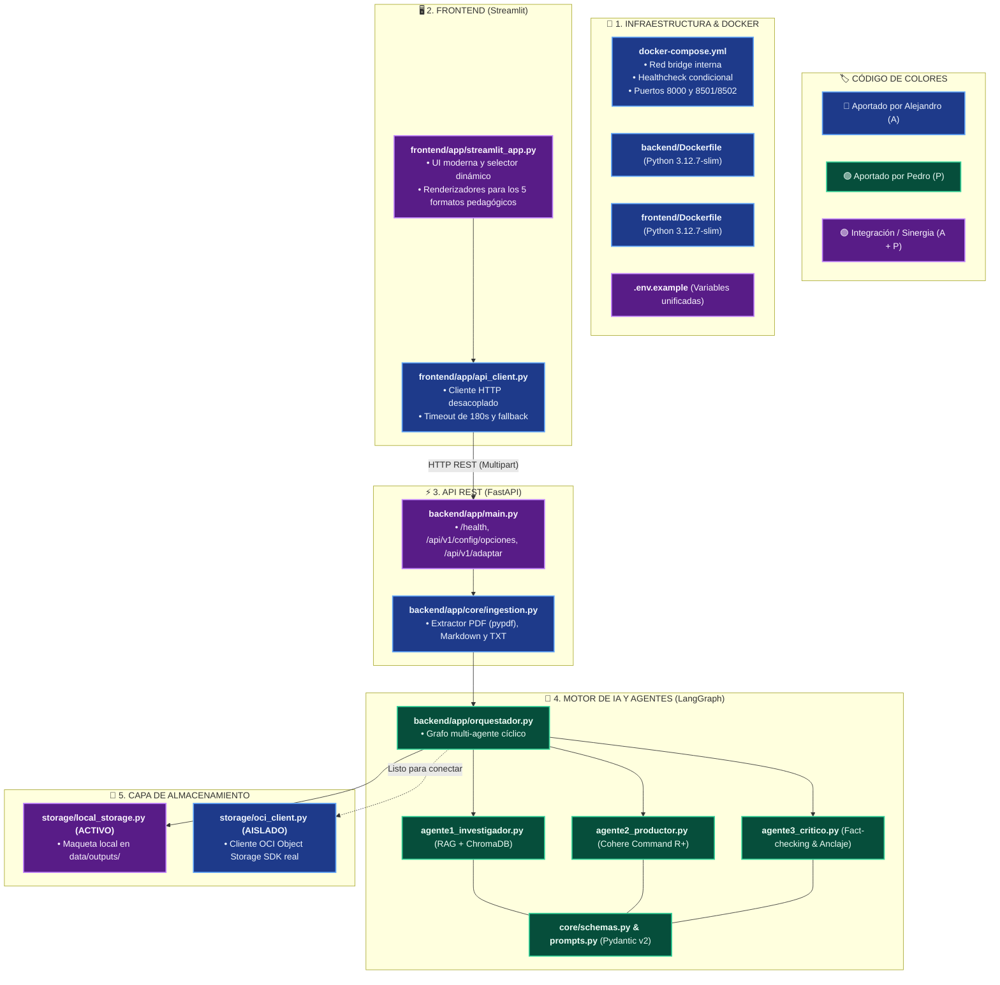

# 🧠 NuevaMente — Sistema Inteligente de Adaptación y Generación de Contenido Educativo

> **Hackathon ONE G10 · Oracle Next Education & Alura · Proyecto 1**  
> Solución integral desacoplada en **Microservicios (Backend FastAPI + Frontend Streamlit)** con orquestación multi-agente en **LangGraph**, **RAG vectorial con Cohere**, **ChromaDB**, y persistencia en **Oracle Cloud Infrastructure (OCI)**.

---

## 📖 Visión General de la Integración

Esta versión del sistema representa la **fusión arquitectónica** entre dos propuestas clave del equipo:
1. **Infraestructura y Despliegue de Alejandro (A)**: Arquitectura de microservicios reales desacoplados, contenedorización con Docker Compose, servidor web REST con FastAPI, ingesta multi-formato (PDF, Markdown, TXT) y cliente de OCI Object Storage.
2. **Motor de IA y Agentes de Pedro (P)**: Pipeline multi-agente en LangGraph con ciclos de feedback, prompting pedagógico adaptativo con few-shots por formato, RAG con Cohere (`command-r-plus` y `embed-multilingual-v3.0`), validación estricta de esquemas en Pydantic v2 y suite de 59+ pruebas deterministas.

---

## 🏛️ Diagrama de Arquitectura y Mapa de Autoría (A vs. P)



---

## 📂 Estructura del Repositorio

```text
G10-LATAM-equipo10NovaMind/
├── docker-compose.yml             # Orquestación de servicios en Docker (puertos 8000 y 8501/8502)
├── .env.example                   # Plantilla de variables de entorno unificada
├── esquema_integracion_A_P.md     # Documento técnico detallado de integración
│
├── backend/                       # SERVICIO BACKEND (FastAPI + LangGraph + Agentes)
│   ├── Dockerfile                 # Contenedor basado en Python 3.12.7-slim
│   ├── requirements.txt           # Dependencias limpias (FastAPI, Cohere, ChromaDB, LangGraph)
│   ├── pytest.ini                 # Configuración del runner de pruebas
│   ├── tests/                     # Suite de pruebas automatizadas (63 tests)
│   │   ├── test_api.py            # Pruebas de endpoints FastAPI
│   │   ├── test_orquestador.py    # Pruebas unitarias de agentes y LangGraph
│   │   └── test_integracion_offline.py # Pruebas E2E offline
│   ├── data/                      # Persistencia de datos
│   │   ├── chroma/                # Base vectorial persistente de ChromaDB
│   │   ├── documents/             # Documentos cargados temporalmente
│   │   └── outputs/               # Salidas persistidas por la maqueta de OCI
│   └── app/
│       ├── main.py                # Servidor FastAPI (/health, /config/opciones, /adaptar)
│       ├── orquestador.py         # Grafo LangGraph y orquestación multi-agente
│       ├── agentes/               # Clases independientes de los 3 agentes
│       │   ├── agente1_investigador.py
│       │   ├── agente2_productor.py
│       │   └── agente3_critico.py
│       ├── core/                  # Módulos centrales de negocio
│       │   ├── schemas.py         # Modelos Pydantic v2 estrictos (5 formatos del brief)
│       │   ├── prompts.py         # Prompts adaptativos y few-shots por formato
│       │   ├── config.py          # Validación de variables de entorno
│       │   └── ingestion.py       # Extractor multi-formato (PDF, MD, TXT)
│       └── storage/               # Capa de almacenamiento
│           ├── local_storage.py   # Maqueta activa (guarda en data/outputs/)
│           └── oci_client.py      # Cliente real de OCI Object Storage
│
└── frontend/                      # SERVICIO FRONTEND (Streamlit)
    ├── Dockerfile                 # Contenedor basado en Python 3.12.7-slim
    ├── requirements.txt           # Dependencias mínimas (Streamlit, Requests)
    └── app/
        ├── streamlit_app.py       # Interfaz visual con renderizadores para los 5 formatos
        └── api_client.py          # Cliente HTTP desacoplado con timeout de 180s
```

---

## 🎯 Los 5 Formatos Pedagógicos Soportados

El sistema adapta cualquier documento técnico a **5 formatos pedagógicos especializados**, validados por esquemas Pydantic estrictos y renderizados interactivamente en la interfaz:

1. **🗂️ Flashcards de Estudio**: Tarjetas interactivas con pregunta/frente, respuesta/reverso oculta y etiquetas de concepto clave.
2. **📝 Quiz Interactivo con Justificaciones**: Preguntas de opción múltiple con validación inmediata de acierto y explicación técnica de por qué es correcta.
3. **🛠️ Guía Práctica Paso a Paso (Tutorial)**: Procedimiento numerado con instrucciones de acción claras y llamadas de advertencia/tips.
4. **📋 Resumen Ejecutivo (TL;DR)**: Puntos clave condensados con su correspondiente análisis de *¿por qué le importa al destinatario?*.
5. **🎬 Guion de Clase / Video**: Segmentos temporizados minuto a minuto con texto de locución y apoyos visuales sugeridos.

---

## 🚀 Despliegue y Puesta en Marcha

### Requisitos Previos
- **Python 3.12.7** (para ejecución local en entorno virtual).
- **Docker & Docker Compose** (para despliegue en contenedores).
- **API Key de Cohere**: Obtén tu clave en [cohere.com](https://cohere.com).

---

### Opción A: Despliegue con Docker Compose (Recomendado)


### Opción B: Ejecución Local en Terminales Separadas


## 💾 Capa de Almacenamiento: Maqueta Activa vs. OCI Real

Para facilitar el desarrollo y permitir demos completas sin depender obligatoriamente de una cuenta activa de Oracle Cloud, la solución cuenta con una arquitectura de almacenamiento desacoplada:

1. **Maqueta Activa (`backend/app/storage/local_storage.py`)**:
   - Está conectada por defecto en el grafo LangGraph.
   - Guarda los documentos originales y el JSON resultante en `backend/data/outputs/`.
   - Simula y retorna el contrato `AlmacenamientoOCI(bucket="local-mock-storage", objeto_id=..., status_upload="completado")`.
2. **Cliente OCI Real (`backend/app/storage/oci_client.py`)**:
   - Desarrollado por Alejandro con el SDK oficial de OCI (`oci`).
   - Se mantiene aislado en su propio archivo, listo para conectarse pasando sus credenciales en `.env` y activándolo en `backend/app/main.py`.

---

## 🧪 Pruebas Automatizadas

El backend incluye una suite exhaustiva de pruebas unitarias, de regresión y de endpoints HTTP:

```bash
cd backend
python -m pytest tests/ -v
```

### Cobertura de las Pruebas:
- **`tests/test_api.py` (4 tests)**: Valida los endpoints `/health`, `/api/v1/config/opciones` y `/api/v1/adaptar` con `TestClient`.
- **`tests/test_integracion_offline.py` (3 tests)**: Valida el ciclo completo del grafo LangGraph con embeddings y LLM simulados.
- **`tests/test_orquestador.py` (56 tests)**: Pruebas unitarias de los agentes, normalización de alias, robustez ante fallos transitorios, validación estricta de esquemas por formato y cálculo matemático del anclaje a fuentes.

**Resultado actual: 63 pasados, 0 fallidos (100% de éxito).**

---

## 👥 Créditos y Contribuciones

- **Alejandro**: Arquitectura de microservicios, contenedorización Docker Compose, servidor REST FastAPI, módulo de ingesta multi-formato y cliente de OCI Object Storage.
- **Pedro**: Lógica multi-agente en LangGraph, prompting pedagógico, RAG con Cohere y ChromaDB, contratos de datos Pydantic v2 y suite de pruebas unitarias.
- **Equipo NovaMind**: Sinergia, pruebas de integración, renderizadores temáticos en Streamlit y calibración de umbrales de calidad.
