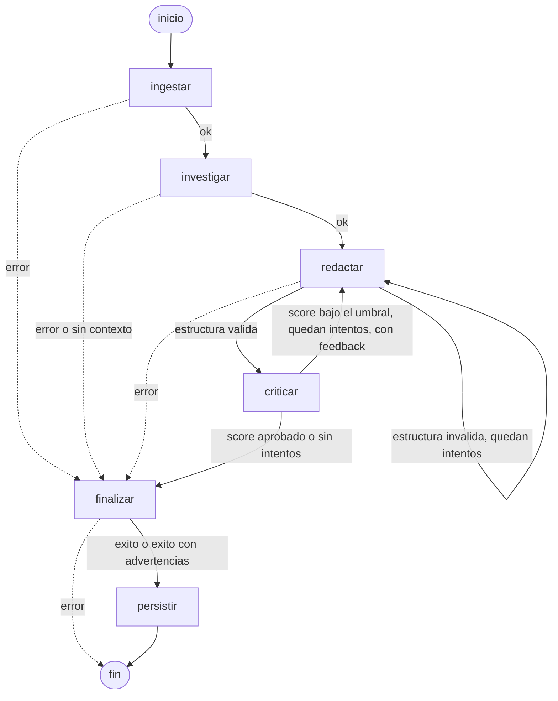

# NuevaMente — Sistema Inteligente de Adaptación y Generación de Contenido Educativo

Hackathon ONE G10 · Oracle Next Education & Alura · Proyecto 1

NuevaMente ingiere documentación técnica (PDF, Markdown o texto) y genera contenido
educativo adaptado al **perfil del destinatario**, al **nicho/sector** y al **formato
pedagógico** elegido, anclado a la fuente original para evitar alucinaciones.

## Arquitectura

```
Documento ─► Ingesta ─► Agente 1 (Investigador RAG) ─► Agente 2 (Productor) ─► Agente 3 (Crítico)
                              │  chunking + embeddings        │  LLM + RAG            │ audita fidelidad
                              │  ChromaDB (cosine)            │  role + few-shot      │ contra los chunks
                              ▼                               ▼                       ▼
                        ┌───────────────────────────────────────────────────────────────┐
                        │        Orquestador LangGraph (app/orquestador.py)             │
                        │  valida entrada · decide reintentos · maneja errores · OCI     │
                        └───────────────────────────────────────────────────────────────┘
                                                    │
                                        JSON estructurado ─► OCI Object Storage (Always Free)
```

### Grafo de orquestación (generado desde el grafo real con `orquestador.diagrama_mermaid()`)



| Nodo | Responsabilidad |
|---|---|
| `ingestar` | Indexa el documento (id estable por hash: no se vuelve a embeber entre escenarios). |
| `investigar` | Recupera chunks relevantes (top-k, similitud mínima, respaldo sin umbral) y los ordena por posición. |
| `redactar` | Llama al Agente 2 con el feedback del crítico y valida con tipado estricto los `items` del formato. |
| `criticar` | Llama al Agente 3, registra el score y conserva el mejor intento. |
| `finalizar` | Decide `exito`, `exito_con_advertencias` o `error` y arma la respuesta. |
| `persistir` | Sube el resultado a OCI Object Storage mediante el almacenador inyectado. |

### Robustez del RAG

El Agente 1 envía embeddings en lotes de hasta 96 textos, no borra una indexación válida antes de obtener los embeddings y actualiza el Vector Store mediante `upsert`, eliminando únicamente chunks obsoletos después de aceptar el nuevo conjunto. La consulta también limita `n_results` a los elementos disponibles.

### Fidelidad a la fuente (anti-alucinación)

1. El Agente 2 usa role prompting, reglas explícitas de fidelidad y un ejemplo few-shot de transformación.
2. El Agente 3 recibe el contexto real de adaptación (perfil, formato, nivel y nicho) y lista las afirmaciones técnicas
   del contenido marcándolas como respaldadas o no por los chunks.
3. El `anclaje_fuente_score` **se calcula en código** (`respaldadas / totales`), no lo inventa el LLM.
4. El ciclo solo aprueba cuando el anclaje supera `MIN_ANCLAJE_FUENTE_SCORE` **y** la claridad pedagógica no es `Baja`.
5. Si falla alguno de esos criterios, el feedback se pasa al redactor hasta `MAX_REDACCION_RETRIES` veces.
6. Si se agotan los reintentos se entrega el **mejor intento** con `status = "exito_con_advertencias"`.

### Manejo de errores

Nada lanza excepciones hacia la interfaz: `ejecutar()` siempre devuelve una `RespuestaAdaptacion`.
Los errores llevan un `codigo` (`ENTRADA_INVALIDA`, `DOCUMENTO_VACIO`, `SIN_CONTEXTO`, `ERROR_GENERACION`,
`ERROR_CRITICO`, `ERROR_INDEXACION`, `ERROR_INESPERADO`) y un `mensaje_amigable` en español. Los fallos
transitorios de API (429, 5xx, timeouts) se reintentan con backoff exponencial (tenacity). Contenido
que el crítico no pudo verificar **no se entrega**.

## Instalación

```bash
git clone <url-del-repo> && cd <repo>
python -m venv .venv
source .venv/bin/activate          # Windows: .venv\Scripts\activate
pip install -r requirements.txt
cp .env.example .env               # Windows: copy .env.example .env
# edita .env y pega tu COHERE_API_KEY
```

## Uso

### Demo (3 escenarios sobre un mismo documento)

```bash
python demo_orquestacion.py
python demo_orquestacion.py --archivo mi_documento.md --titulo "Mi manual"
```

### Desde código (Streamlit, API o notebook)

```python
from app.orquestador import crear_orquestador

orquestador = crear_orquestador()            # lee .env
respuesta = orquestador.ejecutar({
    "documento_titulo": "Introduccion a la Arquitectura de Redes VCN en OCI",
    "documento_contenido": "...texto extraído del PDF/MD/TXT...",
    "perfil_destinatario": "Principiante",   # también: "Líder Técnico / Arquitecto", etc.
    "formato_salida": "Flashcards",          # también: "Quiz Interactivo con Justificaciones", ...
    "nicho_sector": "General",
    "nivel_detalle": "Didáctico",
})

if respuesta.status == "error":
    print(respuesta.error.mensaje_amigable)   # mostrar al usuario
else:
    print(respuesta.model_dump_json(indent=2))  # JSON del brief
```

### Integración con OCI Object Storage

El orquestador recibe una función `almacenador(solicitud, respuesta) -> AlmacenamientoOCI`:

```python
from app.core.schemas import AlmacenamientoOCI

def subir_a_oci(solicitud, respuesta) -> AlmacenamientoOCI:
    # 1) sube solicitud.documento_contenido (original) y respuesta.model_dump_json()
    # 2) devuelve dónde quedó guardado
    return AlmacenamientoOCI(
        bucket="nuevamente-contenidos-educativos",
        objeto_id="contenido-vcn-principiante-flashcards-001.json",
        status_upload="completado",
    )

orquestador = crear_orquestador(almacenador=subir_a_oci)
```

Si la subida falla, el contenido se entrega igual con `almacenamiento_oci.status_upload = "error"` y una advertencia.

## Configuración (`.env`)

| Variable | Defecto | Descripción |
|---|---|---|
| `COHERE_API_KEY` | — | Clave de Cohere (obligatoria). **Nunca la subas a Git.** |
| `COHERE_MODEL` | `command-a-03-2025` | Modelo de generación (Agentes 2 y 3). |
| `COHERE_EMBEDDING_MODEL` | `embed-multilingual-v3.0` | Modelo de embeddings (Agente 1). |
| `TOP_K_CHUNKS` | `6` | Chunks recuperados por consulta. |
| `MIN_SCORE_RETRIEVAL` | `0.60` | Similitud coseno mínima para aceptar un chunk. |
| `MIN_ANCLAJE_FUENTE_SCORE` | `0.75` | Score mínimo de fidelidad para aprobar. Además, la claridad pedagógica no puede ser `Baja`. |
| `MAX_REDACCION_RETRIES` | `2` | Reintentos de redacción (intentos totales = 1 + valor). |
| `API_REINTENTOS` / `API_ESPERA_BASE_SEGUNDOS` | `3` / `1.0` | Reintentos con backoff ante fallos transitorios. |

## Pruebas

```bash
python -m pytest tests -v
```

Corren **sin red ni API key**: agentes falsos para el orquestador y un Cohere simulado para la
integración completa (Agentes 1, 2, 3 reales + ChromaDB real).

## Estructura

```
agente1_investigador.py   Agente 1 · RAG (chunking, embeddings, ChromaDB)
agente2_productor.py      Agente 2 · Productor de contenido (LLM)
agente3_critico.py        Agente 3 · Crítico / Revisor
app/core/schemas.py       Contratos Pydantic compartidos (entrada, salida, evaluación)
app/core/prompts.py       Prompts del Productor y Crítico (role prompting + few-shot)
app/core/config.py        Configuración validada desde el entorno
app/orquestador.py        Orquestador LangGraph
demo_orquestacion.py      Demo de 3 escenarios
tests/                    Pruebas unitarias e integración offline
```
