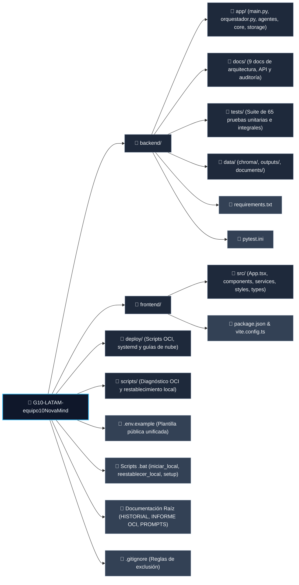
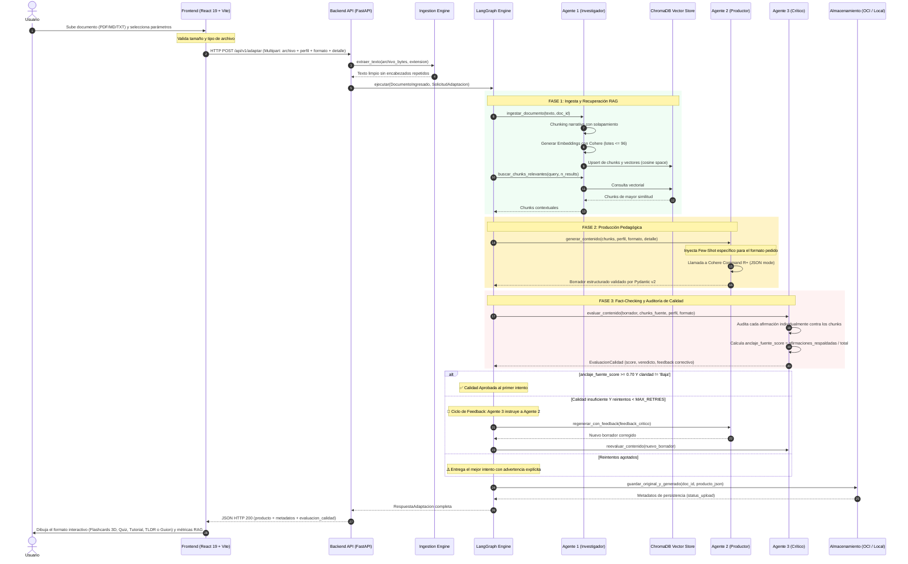
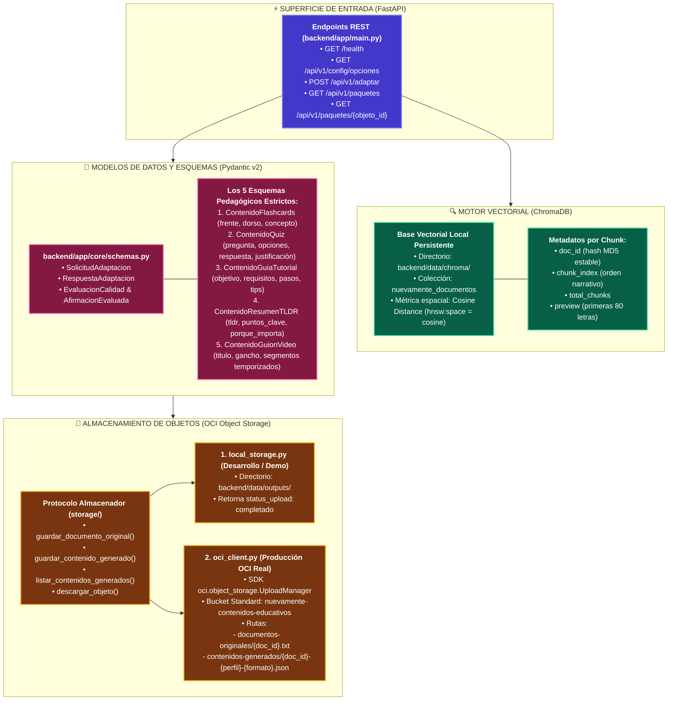

# 🧠 NuevaMente — Sistema Inteligente de Adaptación y Generación de Contenido Educativo

> **Desarrollado por el Equipo 10 (G10 - NovaMind) para No-Country**  
> **Hackathon ONE G10 · Oracle Next Education & Alura · Proyecto 1**  
> Solución integral desacoplada en **Microservicios (Backend FastAPI + Frontend React 19 + Vite)** con orquestación multi-agente en **LangGraph**, **RAG vectorial con Cohere**, **ChromaDB**, y persistencia modular.

---

## 📖 Visión General del Proyecto

**NuevaMente** es una plataforma diseñada para democratizar y personalizar el aprendizaje técnico. Transforma documentos complejos (manuales de ingeniería, guías de arquitectura, documentación de APIs) en **5 formatos pedagógicos adaptados** al perfil del estudiante, nivel de profundidad y sector laboral.

### La Fusión Arquitectónica (Alejandro + Pedro)
Este sistema consolida la integración técnica de dos líneas de trabajo del equipo:
1. **Infraestructura y Despliegue (Alejandro)**: Arquitectura de microservicios reales desacoplados, servidor web REST en FastAPI, ingesta multi-formato (PDF con extracción limpia, Markdown, TXT), cliente SDK de OCI Object Storage y despliegue modular de bajo consumo.
2. **Motor de IA y Agentes (Pedro)**: Grafo cíclico multi-agente en LangGraph con feedback correctivo, prompting adaptativo con few-shots específicos por formato, RAG con Cohere (`command-r-plus` y `embed-multilingual-v3.0`), validación estricta de esquemas con Pydantic v2 y suite determinista de 65 pruebas automatizadas.

---

## 🏛️ 1. Diagrama de Arquitectura General

El sistema opera bajo un modelo cliente-servidor desacoplado mediante contratos HTTP REST:

```mermaid
graph TD
    %% Estilos de Nodos
    classDef client fill:#1e3a8a,stroke:#60a5fa,stroke-width:2px,color:#eff6ff;
    classDef api fill:#581c87,stroke:#c084fc,stroke-width:2px,color:#faf5ff;
    classDef agent fill:#064e3b,stroke:#34d399,stroke-width:2px,color:#ecfdf5;
    classDef storage fill:#854d0e,stroke:#facc15,stroke-width:2px,color:#fefce8;
    classDef external fill:#1f2937,stroke:#9ca3af,stroke-width:1.5px,color:#f9fafb;

    %% CAPA CLIENTE / FRONTEND
    subgraph CAPA_FRONTEND ["🖥️ CAPA DE PRESENTACIÓN (React 19 + Vite)"]
        UI["<b>Interfaz Web SPA (React + TypeScript)</b><br/>• Selector dinámico de opciones<br/>• Ingesta drag & drop (PDF, MD, TXT)<br/>• Renderizadores dinámicos de los 5 formatos<br/>• Dashboard de métricas y OCI"]:::client
        HTTP_CLIENT["<b>Cliente API (services/api.ts)</b><br/>• Fetch multipart/form-data desacoplado<br/>• Conexión viva a FastAPI y fallback resiliente"]:::client
        UI --> HTTP_CLIENT
    end

    %% CAPA SERVICIO / BACKEND
    subgraph CAPA_BACKEND ["⚡ CAPA DE SERVICIO Y API REST (FastAPI)"]
        API_ROUTER["<b>FastAPI Router (main.py)</b><br/>• GET /health<br/>• GET /api/v1/config/opciones<br/>• POST /api/v1/adaptar (multipart)<br/>• GET /api/v1/paquetes"]:::api
        INGESTION_ENGINE["<b>Motor de Ingesta (ingestion.py)</b><br/>• Extractor PDF (pypdf con limpieza)<br/>• Extractor Markdown / TXT (UTF-8)"]:::api
        API_ROUTER --> INGESTION_ENGINE
    end

    %% CAPA MOTOR DE IA
    subgraph CAPA_IA ["🧠 MOTOR DE IA MULTI-AGENTE (LangGraph)"]
        ORQUESTADOR["<b>Orquestador de Estados (orquestador.py)</b><br/>• Ciclo de feedback y reintentos (MAX_RETRIES)<br/>• Selección del mejor intento verificado"]:::agent
        
        AG1["<b>Agente 1: Investigador RAG</b><br/>• Chunking narrativo con solapamiento<br/>• Embeddings Cohere en lotes"]:::agent
        AG2["<b>Agente 2: Productor</b><br/>• Prompts adaptativos por perfil<br/>• Few-shots específicos por formato"]:::agent
        AG3["<b>Agente 3: Crítico de Calidad</b><br/>• Fact-checking contra chunks fuente<br/>• Cálculo de anclaje_fuente_score"]:::agent

        ORQUESTADOR --> AG1
        ORQUESTADOR --> AG2
        ORQUESTADOR --> AG3
    end

    %% CAPA EXTERNA DE IA
    subgraph SERVICIOS_EXTERNOS ["🌐 SERVICIOS COHERE AI (Nube)"]
        COHERE_EMBED["<b>Cohere Embed API</b><br/>embed-multilingual-v3.0 (1024 dims)"]:::external
        COHERE_CHAT["<b>Cohere Chat API</b><br/>command-r-plus-08-2024"]:::external
    end

    %% CAPA DE ALMACENAMIENTO
    subgraph CAPA_DATOS ["💾 CAPA DE PERSISTENCIA Y DATOS"]
        CHROMA_DB[("<b>ChromaDB Nativo</b><br/>• Colección nuevamente_documentos<br/>• Persistencia en disco local")]:::storage
        STORAGE_ROUTER{"<b>Almacenador Híbrido Resiliente</b><br/>(Prioridad OCI + Fallback Local)"}:::storage
        LOCAL_OUTPUTS[("<b>Almacenamiento Local</b><br/>backend/data/outputs/<br/>(Activo como fallback/offline)")]:::storage
        OCI_BUCKET[("<b>OCI Object Storage (Capa Always Free)</b><br/>Bucket: nuevamente-contenidos-educativos<br/>(sa-santiago-1)")]:::storage

        STORAGE_ROUTER -->|Principal (Online)| OCI_BUCKET
        STORAGE_ROUTER -.->|Fallback (Offline/Error)| LOCAL_OUTPUTS
    end

    %% CONEXIONES INTER-CAPAS
    HTTP_CLIENT -- "HTTP POST (Multipart)" --> API_ROUTER
    INGESTION_ENGINE -- "Texto limpio normalizado" --> ORQUESTADOR
    AG1 <--> COHERE_EMBED
    AG1 <--> CHROMA_DB
    AG2 <--> COHERE_CHAT
    AG3 <--> COHERE_CHAT
    ORQUESTADOR --> STORAGE_ROUTER
```

---

## 📂 2. Diagrama de Estructura de Carpetas

La arquitectura del repositorio sigue una estricta separación de responsabilidades para aislar el frontend, la API de servicio y el motor multi-agente:


```mermaid
graph LR
    %% Estilos
    classDef root fill:#0f172a,stroke:#38bdf8,stroke-width:2px,color:#f0f9ff;
    classDef dir fill:#1e293b,stroke:#94a3b8,stroke-width:1px,color:#f8fafc;
    classDef file fill:#334155,stroke:#cbd5e1,stroke-width:1px,color:#f8fafc;

    ROOT["📁 G10-LATAM-equipo10NovaMind"]:::root

    %% BACKEND
    ROOT --> B_DIR["📁 backend/"]:::dir
    B_DIR --> B_APP["📁 app/ (main.py, orquestador.py, agentes, core, storage)"]:::dir
    B_DIR --> B_DOCS["📁 docs/ (9 docs de arquitectura, API y auditoría)"]:::dir
    B_DIR --> B_TESTS["📁 tests/ (Suite de 65 pruebas unitarias e integrales)"]:::dir
    B_DIR --> B_DATA["📁 data/ (chroma/, outputs/, documents/)"]:::dir
    B_DIR --> B_REQ["📄 requirements.txt"]:::file
    B_DIR --> B_INI["📄 pytest.ini"]:::file

    %% FRONTEND
    ROOT --> F_DIR["📁 frontend/"]:::dir
    F_DIR --> F_SRC["📁 src/ (App.tsx, components, services, styles, types)"]:::dir
    F_DIR --> F_PKG["📄 package.json & vite.config.ts"]:::file

    %% DEPLOY & SCRIPTS
    ROOT --> D_DIR["📁 deploy/ (Scripts OCI, systemd y guías de nube)"]:::dir
    ROOT --> S_DIR["📁 scripts/ (Diagnóstico OCI y restablecimiento local)"]:::dir

    %% RAÍZ
    ROOT --> R_ENV["📄 .env.example (Plantilla pública unificada)"]:::file
    ROOT --> R_BAT["📄 Scripts .bat (iniciar_local, reestablecer_local, setup)"]:::file
    ROOT --> R_DOC["📄 Documentación Raíz (HISTORIAL, INFORME OCI, PROMPTS)"]:::file
    ROOT --> R_GIT["📄 .gitignore (Reglas de exclusión)"]:::file
```

### Detalle de Carpetas y Responsabilidades Técnicas

```text
G10-LATAM-equipo10NovaMind/
├── .env.example                       # Plantilla de variables de entorno (Cohere, OCI, ChromaDB)
├── .gitignore                         # Exclusiones estrictas (.env, *.pem, __pycache__, .venv)
├── CONTRIBUTING.md                    # Normas de contribución y flujo de ramas de Git
├── README.md                          # Documentación maestra y manual general del proyecto
├── requirements.txt                   # Dependencias principales unificadas de Python (FastAPI + LangGraph)
├── iniciar_local.bat                  # Script para arranque concurrente (FastAPI :8000 + React Vite :5173)
├── reestablecer_local.bat             # Script de restablecimiento y limpieza de entorno local
├── setup.bat                          # Asistente de verificación e instalación de dependencias
│
├── historial_progreso/                # 📚 BITÁCORAS, REPORTES DE INTEGRACIÓN Y ARQUITECTURA
│   ├── README.md                      # Índice descriptivo del contenido de la carpeta
│   ├── CAMBIOS.md                     # Bitácora detallada de versiones y cambios del proyecto
│   ├── ESQUEMA_INTEGRACION_FULLSTACK.md # Especificación técnica y diagramas Backend + Frontend + OCI
│   ├── HISTORIAL_PROBLEMAS_Y_SOLUCIONES.md # Base de conocimiento con 21 incidencias resueltas
│   ├── INFORME_INTEGRACION_OCI_FASE3.md # Informe de arquitectura y persistencia híbrida en OCI
│   ├── INFORME_INTEGRACION_FRONTEND_REACT.md # Informe de conexión de la UI React con FastAPI
│   ├── INSTRUCCIONES_INSTALACION_PRUEBAS.txt # Guía rápida en texto plano para instalación y tests
│   ├── PROMPT_CONTEXTO_AGENTE.md      # Contexto técnico para asistencia con modelos de IA
│   └── PROMPT_DESPLIEGUE_OCI_PRIVADO.md # Guía paso a paso para despliegue en instancias de Oracle Cloud
│
├── legado/                            # 🏛️ ARTEFACTOS PRELIMINARES Y PROPUESTAS HISTÓRICAS
│   ├── README.md                      # Explicación histórica de archivos preservados
│   ├── requirements_LegacyAlejandro.txt # Dependencias del prototipo inicial (Alejandro)
│   ├── requirements_LegacyPedro.txt   # Dependencias de la propuesta previa (Pedro)
│   ├── pedro_squema1.png              # Primer boceto de arquitectura propuesto por Pedro
│   ├── esquema_integracion_A_P.md     # Mapeo comparativo preliminar Alejandro vs. Pedro
│   ├── esquema_integracion_A_P.png    # Diagrama gráfico de la propuesta preliminar
│   └── esquema_integracion_A_P.svg    # Diagrama vectorial preliminar
│
├── backend/                           # MICROSERVICIO BACKEND (FastAPI + LangGraph + Agentes)
│   ├── requirements.txt               # Dependencias limpias fijadas para Python 3.12.7
│   ├── pytest.ini                     # Configuración de pytest (testpaths = tests)
│   ├── docs/                          # Paquete de documentación técnica y auditoría
│   │   ├── API.md                     # Referencia exhaustiva de endpoints REST y contratos
│   │   ├── ARCHITECTURE.md            # Diagramas de secuencia y flujo Mermaid del backend
│   │   ├── CHANGELOG.md               # Registro de versiones técnicas del backend
│   │   ├── DATABASE.md                # Persistencia (ChromaDB vectorial, Local y OCI)
│   │   ├── DEPLOYMENT.md              # Manual de configuración, variables y despliegue
│   │   ├── OPERATIONS.md              # Observabilidad, logs, healthcheck y diagnóstico
│   │   ├── PROJECT_AUDIT.md           # Informe de auditoría estática y matriz de prioridades
│   │   ├── SECURITY.md                # Evaluación de controles y seguridad preventiva
│   │   └── TESTING.md                 # Estrategia de testing y pruebas unitarias/integrales
│   ├── tests/                         # Suite de pruebas deterministas (65 tests pasando - 100%)
│   │   ├── test_api.py                # Validación de endpoints REST con TestClient
│   │   ├── test_orquestador.py        # Pruebas unitarias de agentes, contratos y feedback
│   │   └── test_integracion_offline.py# Pipeline E2E con dependencias simuladas
│   ├── data/                          # Directorio de persistencia
│   │   ├── chroma/                    # Base vectorial persistente de ChromaDB
│   │   ├── documents/                 # Archivos fuente temporales y documentos cargados
│   │   └── outputs/                   # Salidas persistidas por la maqueta local de OCI
│   └── app/                           # Código fuente de la aplicación
│       ├── main.py                    # Servidor FastAPI (/health, /opciones, /adaptar, /paquetes)
│       ├── orquestador.py             # Grafo de ejecución LangGraph y control de ciclo pedagógico
│       ├── agentes/                   # Clases independientes de los 3 agentes pedagógicos
│       │   ├── agente1_investigador.py# Ingesta, chunking y búsqueda semántica RAG
│       │   ├── agente2_productor.py   # Generación adaptativa con few-shots y formatos
│       │   └── agente3_critico.py     # Fact-checking y evaluación de anclaje a fuentes
│       ├── core/                      # Módulos centrales de lógica de negocio
│       │   ├── schemas.py             # Modelos Pydantic v2 de los 5 formatos y validadores
│       │   ├── prompts.py             # Prompts de sistema y ejemplos estructurados
│       │   ├── config.py              # Validación de variables de entorno y fallbacks
│       │   └── ingestion.py           # Extractor multi-formato (PDF, Markdown, TXT)
│       └── storage/                   # Capa de almacenamiento y persistencia híbrida
│           ├── local_storage.py       # Almacenamiento local estructurado (data/outputs/)
│           └── oci_client.py          # Cliente oficial con SDK de Oracle Cloud Object Storage
│
├── frontend/                          # MICROSERVICIO FRONTEND (React + Vite + TypeScript)
│   ├── package.json                   # Dependencias de UI (React 19, GSAP, Lenis, Lucide)
│   ├── vite.config.ts                 # Configuración del empaquetador Vite
│   ├── index.html                     # Entrypoint HTML de la aplicación web
│   └── src/                           # Código fuente TypeScript / TSX
│       ├── App.tsx                    # Componente raíz con orquestación de vistas y estado
│       ├── main.tsx                   # Punto de montaje del DOM en React 19
│       ├── components/                # Componentes modulares de interfaz
│       │   ├── Header/                # Encabezado con estado y título del documento
│       │   ├── Stepper/               # Indicador de progreso pedagógico de 3 pasos
│       │   ├── IngestView/            # Formulario de subida de archivos y selección de perfiles
│       │   ├── ViewerView/            # Visualizadores interactivos (Flashcards 3D, Quiz, Tutorial)
│       │   └── MetricsView/           # Dashboard de anclaje RAG, métricas y estado OCI
│       ├── services/api.ts            # Cliente HTTP para endpoints FastAPI (/adaptar, /opciones)
│       ├── styles/                    # Design tokens y estilos globales CSS
│       └── types/api.ts               # Contratos e interfaces TypeScript de la API
│
├── deploy/                            # CONFIGURACIONES Y DESPLIEGUE EN NUBE (OCI)
│   ├── README_DESPLIEGUE_OCI.md       # Guía de arquitectura y provisión en Oracle Cloud
│   ├── scripts/                       # Scripts de configuración y despliegue para Linux/Ubuntu
│   └── systemd/                       # Unidades systemd para demonios de Backend y Frontend
│
└── scripts/                           # SCRIPTS AUXILIARES DE MANTENIMIENTO Y DIAGNÓSTICO
    ├── reestablecer_local.py          # Lógica Python de limpieza profunda de cache y entornos
    └── test_oci_conexion.py           # Script CLI de diagnóstico de conexión y subida a OCI
```

---

## 🔄 3. Diagrama de Flujo de Datos y Proceso End-to-End

El ciclo completo de transformación y auditoría pedagógica sigue una máquina de estados determinista gobernada por LangGraph:


```mermaid
sequenceDiagram
    autonumber
    actor Usuario
    participant UI as Frontend (React 19 + Vite)
    participant API as Backend API (FastAPI)
    participant Ingestion as Ingestion Engine
    participant Orquestador as LangGraph Engine
    participant Ag1 as Agente 1 (Investigador)
    participant Chroma as ChromaDB Vector Store
    participant Ag2 as Agente 2 (Productor)
    participant Ag3 as Agente 3 (Crítico)
    participant Storage as Almacenamiento (OCI / Local)

    %% 1. ENTRADA Y VALIDACIÓN
    Usuario->>UI: Sube documento (PDF/MD/TXT) y selecciona parámetros
    Note over UI: Valida tamaño y tipo de archivo
    UI->>API: HTTP POST /api/v1/adaptar (Multipart: archivo + perfil + formato + detalle)
    API->>Ingestion: extraer_texto(archivo_bytes, extension)
    Ingestion-->>API: Texto limpio sin encabezados repetidos
    API->>Orquestador: ejecutar(DocumentoIngresado, SolicitudAdaptacion)

    %% 2. PIPELINE MULTI-AGENTE
    rect rgb(240, 253, 244)
        Note over Orquestador, Chroma: FASE 1: Ingesta y Recuperación RAG
        Orquestador->>Ag1: ingestar_documento(texto, doc_id)
        Ag1->>Ag1: Chunking narrativo con solapamiento
        Ag1->>Ag1: Generar Embeddings con Cohere (lotes <= 96)
        Ag1->>Chroma: Upsert de chunks y vectores (cosine space)
        Orquestador->>Ag1: buscar_chunks_relevantes(query, n_results)
        Ag1->>Chroma: Consulta vectorial
        Chroma-->>Ag1: Chunks de mayor similitud
        Ag1-->>Orquestador: Chunks contextuales
    end

    rect rgb(254, 243, 199)
        Note over Orquestador, Ag2: FASE 2: Producción Pedagógica
        Orquestador->>Ag2: generar_contenido(chunks, perfil, formato, detalle)
        Note over Ag2: Inyecta Few-Shot específico para el formato pedido
        Ag2->>Ag2: Llamada a Cohere Command R+ (JSON mode)
        Ag2-->>Orquestador: Borrador estructurado validado por Pydantic v2
    end

    rect rgb(254, 242, 242)
        Note over Orquestador, Ag3: FASE 3: Fact-Checking y Auditoría de Calidad
        Orquestador->>Ag3: evaluar_contenido(borrador, chunks_fuente, perfil, formato)
        Ag3->>Ag3: Audita cada afirmación individualmente contra los chunks
        Ag3->>Ag3: Calcula anclaje_fuente_score = afirmaciones_respaldadas / total
        Ag3-->>Orquestador: EvaluacionCalidad (score, veredicto, feedback correctivo)
    end

    %% 3. CONTROL DE CICLO Y DECISIÓN
    alt anclaje_fuente_score >= 0.70 Y claridad != 'Baja'
        Note over Orquestador: ✅ Calidad Aprobada al primer intento
    else Calidad insuficiente Y reintentos < MAX_RETRIES
        Note over Orquestador: 🔄 Ciclo de Feedback: Agente 3 instruye a Agente 2
        Orquestador->>Ag2: regenerar_con_feedback(feedback_critico)
        Ag2-->>Orquestador: Nuevo borrador corregido
        Orquestador->>Ag3: reevaluar_contenido(nuevo_borrador)
    else Reintentos agotados
        Note over Orquestador: ⚠️ Entrega el mejor intento con advertencia explícita
    end

    %% 4. PERSISTENCIA Y RESPUESTA
    Orquestador->>Storage: guardar_original_y_generado(doc_id, producto_json)
    Storage-->>Orquestador: Metadatos de persistencia (status_upload)
    Orquestador-->>API: RespuestaAdaptacion completa
    API-->>UI: JSON HTTP 200 (producto + metadatos + evaluacion_calidad)
    UI->>Usuario: Dibuja el formato interactivo (Flashcards 3D, Quiz, Tutorial, TLDR o Guion) y métricas RAG
```

---

## 🗄️ 4. Repositorios de Base de Datos y Capa Backend

La capa Backend se compone de tres motores de almacenamiento y persistencia claramente delimitados:


```mermaid
graph TD
    %% Estilos
    classDef api fill:#4338ca,stroke:#818cf8,stroke-width:2px,color:#ffffff;
    classDef vector fill:#065f46,stroke:#34d399,stroke-width:2px,color:#ffffff;
    classDef schema fill:#831843,stroke:#f472b6,stroke-width:2px,color:#ffffff;
    classDef storage fill:#78350f,stroke:#f59e0b,stroke-width:2px,color:#ffffff;

    subgraph API_SURFACE ["⚡ SUPERFICIE DE ENTRADA (FastAPI)"]
        ENDPOINTS["<b>Endpoints REST (backend/app/main.py)</b><br/>• GET /health<br/>• GET /api/v1/config/opciones<br/>• POST /api/v1/adaptar<br/>• GET /api/v1/paquetes<br/>• GET /api/v1/paquetes/{objeto_id}"]:::api
    end

    subgraph VECTOR_ENGINE ["🔍 MOTOR VECTORIAL (ChromaDB)"]
        CHROMA_PERSIST["<b>Base Vectorial Local Persistente</b><br/>• Directorio: backend/data/chroma/<br/>• Colección: nuevamente_documentos<br/>• Métrica espacial: Cosine Distance (hnsw:space = cosine)"]:::vector
        CHROMA_META["<b>Metadatos por Chunk:</b><br/>• doc_id (hash MD5 estable)<br/>• chunk_index (orden narrativo)<br/>• total_chunks<br/>• preview (primeras 80 letras)"]:::vector
        CHROMA_PERSIST --- CHROMA_META
    end

    subgraph CONTRACTS ["📜 MODELOS DE DATOS Y ESQUEMAS (Pydantic v2)"]
        SCHEMA_CORE["<b>backend/app/core/schemas.py</b><br/>• SolicitudAdaptacion<br/>• RespuestaAdaptacion<br/>• EvaluacionCalidad & AfirmacionEvaluada"]:::schema
        SCHEMA_FORMATS["<b>Los 5 Esquemas Pedagógicos Estrictos:</b><br/>1. ContenidoFlashcards (frente, dorso, concepto)<br/>2. ContenidoQuiz (pregunta, opciones, respuesta, justificación)<br/>3. ContenidoGuiaTutorial (objetivo, requisitos, pasos, tips)<br/>4. ContenidoResumenTLDR (tldr, puntos_clave, porque_importa)<br/>5. ContenidoGuionVideo (titulo, gancho, segmentos temporizados)"]:::schema
        SCHEMA_CORE --- SCHEMA_FORMATS
    end

    subgraph OBJECT_STORAGE ["💾 ALMACENAMIENTO DE OBJETOS (OCI Object Storage)"]
        INTERFACE["<b>Protocolo Almacenador (storage/)</b><br/>• guardar_documento_original()<br/>• guardar_contenido_generado()<br/>• listar_contenidos_generados()<br/>• descargar_objeto()"]:::storage
        
        MOCK_IMPL["<b>1. local_storage.py (Desarrollo / Demo)</b><br/>• Directorio: backend/data/outputs/<br/>• Retorna status_upload: completado"]:::storage
        OCI_IMPL["<b>2. oci_client.py (Producción OCI Real)</b><br/>• SDK oci.object_storage.UploadManager<br/>• Bucket Standard: nuevamente-contenidos-educativos<br/>• Rutas:<br/>  - documentos-originales/{doc_id}.txt<br/>  - contenidos-generados/{doc_id}-{perfil}-{formato}.json"]:::storage

        INTERFACE --> MOCK_IMPL
        INTERFACE --> OCI_IMPL
    end

    ENDPOINTS --> CONTRACTS
    ENDPOINTS --> VECTOR_ENGINE
    CONTRACTS --> OBJECT_STORAGE
```

---

## 🎯 5. Los 5 Formatos Pedagógicos Soportados

El sistema adapta cualquier documento técnico a **5 formatos pedagógicos especializados**, validados por esquemas Pydantic estrictos y renderizados interactivamente en la interfaz web de React:

| Formato Pedagógico | Modelo Pydantic | Características Principales | Renderizado en Frontend (React 19 + Vite) |
| :--- | :--- | :--- | :--- |
| **🗂️ Flashcards de Estudio** | `ContenidoFlashcards` | Pares de pregunta/respuesta atómicas, concepto clave y nivel de dificultad. | Tarjetas interactivas con efecto 3D flip card, contador de tarjetas y botones de revelación. |
| **📝 Quiz Interactivo** | `ContenidoQuiz` | Preguntas de opción múltiple con 4 alternativas y justificación técnica razonada. | Cuestionario interactivo con feedback instantáneo de acierto/error y justificación explicativa. |
| **🛠️ Guía Paso a Paso (Tutorial)** | `ContenidoGuiaTutorial` | Procedimiento secuencial ordenado con prerrequisitos, pasos de acción y advertencias. | Stepper interactivo con bloques de comandos de terminal y tarjetas de advertencia/tips. |
| **📋 Resumen Ejecutivo (TL;DR)** | `ContenidoResumenTLDR` | Síntesis concisa de alto impacto con análisis de *¿por qué le importa al destinatario?*. | Tarjetas de síntesis, métricas clave expandibles y sección de relevancia práctica. |
| **🎬 Guion de Clase / Video** | `ContenidoGuionVideo` | Guion estructurado por minutos con gancho inicial, contenido central y apoyos visuales. | Timeline secuencial con minutaje por bloque, notas de producción y apoyos visuales. |

---

## 🚀 6. Guía de Puesta en Marcha Local

### Requisitos Previos
- **Python 3.12.7** (versión oficial estandarizada del proyecto).
- **Node.js 18+ y npm** (para la interfaz web React 19).
- **API Key de Cohere**: Regístrate y obtén tu clave gratuita en [cohere.com](https://cohere.com).
- *(Opcional)* Credenciales de Oracle Cloud si se desea persistencia en OCI Object Storage.

### Configurar Variables de Entorno
Copia la plantilla `.env.example` en la raíz como `.env`:
```bash
cp .env.example .env
```
Edita `.env` y configura tu API Key de Cohere:
```env
COHERE_API_KEY=tu_api_key_de_cohere
COHERE_MODEL=command-r-plus-08-2024
EMBEDDING_MODEL=embed-multilingual-v3.0
```

---

### Opción A: Inicio Rápido Automático (Recomendado en Windows)

Ejecuta el script unificado que inicializa ambos microservicios en ventanas independientes:
```powershell
.\iniciar_local.bat
```
* **Backend FastAPI:** Inicia en segundo plano en [http://127.0.0.1:8000](http://127.0.0.1:8000).
* **Frontend React (Vite):** Inicia en [http://localhost:5173](http://localhost:5173).
* Abre automáticamente la aplicación en tu navegador web predeterminado.

---

### Opción B: Arranque Manual por Terminales

#### Terminal 1 — Backend FastAPI:
```bash
# 1. Crear y activar entorno virtual
python -m venv .venv
# Windows:
.\.venv\Scripts\activate
# Linux/macOS:
source .venv/bin/activate

# 2. Instalar dependencias
pip install -r requirements.txt

# 3. Iniciar servidor FastAPI
cd backend
uvicorn app.main:app --host 127.0.0.1 --port 8000 --reload
```
* **API Swagger interactivo:** [http://127.0.0.1:8000/docs](http://127.0.0.1:8000/docs)
* **Healthcheck:** [http://127.0.0.1:8000/health](http://127.0.0.1:8000/health)

#### Terminal 2 — Frontend React (Vite):
```bash
cd frontend
npm install
npm run dev
```
* **Interfaz Web SPA:** [http://localhost:5173](http://localhost:5173)

---

## 🌟 7. Estado Actual de la Integración Full Stack

El proyecto ha completado de manera exitosa y verificada las **5 fases de integración técnica**, consolidando un sistema 100% operativo y desacoplado:

| Fase | Hito Técnico | Estado | Verificación |
| :--- | :--- | :---: | :--- |
| **Fase 1** | **Armonización de Entorno y Contratos** | 🟢 Completada | Dependencias fijadas para Python 3.12.7, esquemas Pydantic v2 unificados y normalización estricta de alias y formatos. |
| **Fase 2** | **Motor Multi-Agente LangGraph** | 🟢 Completada | Grafo cíclico de 3 agentes (RAG ➔ Productor ➔ Crítico) con cálculo de `anclaje_fuente_score` y bucle reflexivo de reintentos. |
| **Fase 3** | **Persistencia Híbrida y Cloud OCI** | 🟢 Completada | Conexión con OCI Object Storage Always Free (bucket: `nuevamente-contenidos-educativos`, región `sa-santiago-1`) y fallback local transparente a `data/outputs/`. |
| **Fase 4** | **Integración Fullstack React 19** | 🟢 Completada | Cliente web React 19 + Vite + TypeScript conectado a FastAPI con Axios, soporte multipart, CORS adaptativo y visualizadores dinámicos. |
| **Fase 5** | **Validación E2E y Pruebas del Sistema** | 🟢 Completada | Suite automatizada de **65/65 pruebas pasando (100%)** y prueba End-to-End en navegador completada con anclaje RAG de **1.00 (100% de respaldo)**. |

---

## ⚙️ 8. Consideraciones Técnicas Clave para la Integración Full Stack

Al desarrollar, extender o desplegar esta arquitectura cliente-servidor, deben tenerse en cuenta las siguientes consideraciones:

### 1. Política CORS y Mapeo de Puertos
* El backend FastAPI corre por defecto en el puerto `8000` (`http://127.0.0.1:8000`), mientras que el frontend Vite se ejecuta en el puerto `5173` (`http://localhost:5173`).
* El backend implementa `CORSMiddleware` en [backend/app/main.py](file:///c:/Users/gdq_1/Documents/Gabotech/Ia_NovaMind/G10-LATAM-equipo10NovamindA/G10-LATAM-equipo10NovaMind/backend/app/main.py) autorizando explícitamente los orígenes `http://localhost:5173`, `http://127.0.0.1:5173` y `http://localhost:8501`. Si se despliega en un puerto o dominio alternativo, debe actualizarse la lista `allow_origins`.

### 2. Contratos Dinámicos de Configuración
* La interfaz de usuario no hardcodea los perfiles ni los formatos pedagógicos. En su lugar, consume al inicio el endpoint `GET /api/v1/config/opciones`.
* Esto permite agregar nuevos perfiles o formatos en el backend (vía Pydantic y prompts) sin necesidad de modificar el código del frontend.

### 3. Ingesta Híbrida (`multipart/form-data`)
* El endpoint `POST /api/v1/adaptar` recibe peticiones en formato multipart.
* Soporta subida de archivos binarios (`.pdf`, `.md`, `.txt`) mediante el campo `archivo`, o texto directo ingresado por el usuario mediante `texto_manual`.
* El motor `ingestion.py` limpia automáticamente los encabezados, pies de página y números de página de los PDFs antes de enviarlos a chunking.

### 4. Persistencia Híbrida y Desacoplamiento de Almacenamiento
* El payload completo del contenido pedagógico adaptado se devuelve de inmediato en el cuerpo de la respuesta HTTP 200, garantizando renderizado instantáneo en la UI sin esperas adicionales.
* Simultáneamente, el `almacenador_resiliente` persiste el resultado en OCI Object Storage (o en `data/outputs/` como fallback local si las credenciales OCI no están presentes). El frontend recibe los metadatos de persistencia (`objeto_id` y `status_upload`) permitiendo su consulta posterior vía `GET /api/v1/paquetes/{objeto_id}`.

### 5. Manejo Seguro de Secretos y Variables de Entorno
* El archivo `.env` está excluido del control de versiones mediante `.gitignore`.
* Toda referencia a credenciales, namespaces de OCI, tenancies y API Keys debe manejarse exclusivamente a través de variables de entorno, usando `.env.example` como referencia pública sanitizada.

### 6. Organización Limpia del Repositorio
* La raíz del repositorio se mantiene minimalista con los archivos esenciales de configuración y ejecución.
* Toda la documentación de avance, bitácoras de incidentes y especificaciones técnicas se encuentra en [historial_progreso/](file:///c:/Users/gdq_1/Documents/Gabotech/Ia_NovaMind/G10-LATAM-equipo10NovamindA/G10-LATAM-equipo10NovaMind/historial_progreso).
* Todos los bocetos preliminares y requisitos de prototipado se conservan para trazabilidad en [legado/](file:///c:/Users/gdq_1/Documents/Gabotech/Ia_NovaMind/G10-LATAM-equipo10NovamindA/G10-LATAM-equipo10NovaMind/legado).

---

## 🧪 9. Suite de Pruebas Automatizadas

El backend cuenta con una suite rigurosa de **65 pruebas automatizadas** que validan la API REST, la lógica del orquestador LangGraph, la normalización de alias, el batching de embeddings, la persistencia resiliente y la robustez ante fallos:

```bash
# Ejecutar desde la raíz con el entorno virtual activo:
pytest backend/tests -v
```

### Distribución de la Cobertura:
* **`tests/test_api.py` (6 tests):** Validación con `TestClient` de `/health`, `/api/v1/config/opciones`, `/api/v1/adaptar` (multipart y texto), `/api/v1/paquetes` y manejo de 404 en descarga de paquetes.
* **`tests/test_integracion_offline.py` (3 tests):** Validación del ciclo E2E con embeddings y LLMs simulados, verificación de reutilización del índice vectorial y adaptación con feedback correctivo.
* **`tests/test_orquestador.py` (56 tests):** Pruebas unitarias de:
  - Puerta de calidad (`anclaje_fuente_score` y claridad pedagógica).
  - Normalización estricta de alias del brief.
  - Inyección de few-shots según formato pedido.
  - Límite de lote de embeddings en llamadas a Cohere (máx. 96 textos).
  - Manejo resiliente de caídas transitorias de API con reintentos exponenciales.

**Estado actual de la suite:** 🟢 **65 pasadas, 0 fallidas (100% de éxito).**

---

## 👥 10. Créditos y Autores del Proyecto

* **Alejandro**: Arquitectura de microservicios, contenedorización Docker inicial, servidor REST en FastAPI, módulo de ingesta multi-formato con pypdf y cliente oficial de OCI Object Storage SDK.
* **Pedro**: Motor multi-agente en LangGraph, prompting pedagógico, RAG vectorial con Cohere y ChromaDB, validación de contratos Pydantic v2 y suite de pruebas unitarias.
* **Equipo NovaMind**: Sinergia técnica de integración, calibración de umbrales de anclaje, cliente HTTP desacoplado en React 19 + Vite, diseño de componentes interactivos y visualizadores dinámicos.
