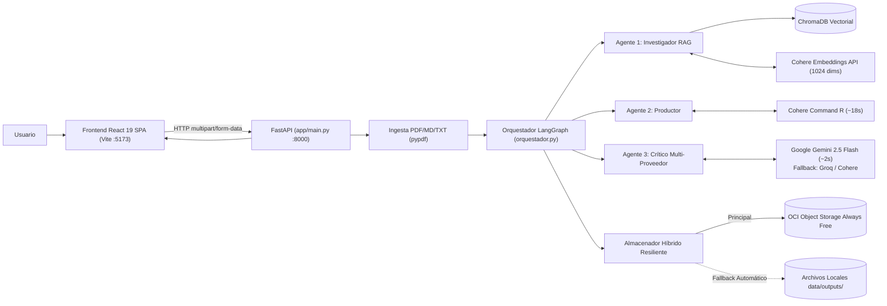
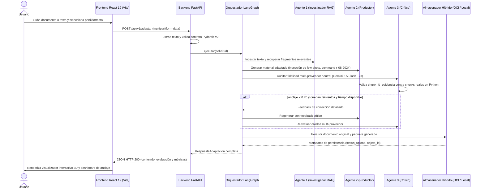

# Arquitectura del Sistema

## Vista General

El sistema **NuevaMente** opera bajo un modelo desacoplado cliente-servidor basado en microservicios, conectando una interfaz web moderna en **React 19 (Vite + TypeScript)** con una API REST en **FastAPI** y un motor de orquestación multi-agente en **LangGraph**:

## Componentes

### 1. Capa de Presentación (Frontend React 19)
- **`frontend/src/App.tsx`**: Orquestador del flujo de gamificación, HUD superior (XP, racha, escudos), modals de medallas (`BadgeModal`) y comunicación con la API.
- **`frontend/src/components/PlayerHUD/`**: Barra superior de estado gamificado en tiempo real (XP acumulado, racha diaria y 3 escudos cognitivos).
- **`frontend/src/components/Step1Ingestion/`**: Ingesta multi-formato con drag-and-drop (.pdf, .md, .txt, texto libre) y botón de 1-click **`⚡ Cargar Guía OCI Swap (Modo Demo)`** con preconfiguración pedagógica óptima.
- **`frontend/src/components/Step2KnowledgeQuest/`**: Orquestador del circuito pedagógico gamificado de 5 estaciones:
  - **Estación 1: Resumen Ninja (`Station1ResumenNinja`)**: Síntesis TL;DR con analogía central y métricas clave.
  - **Estación 2: Flashcard Quest (`Station2FlashcardQuest`)**: Tarjetas interactivas 3D con giros y pistas.
  - **Estación 3: Tutorial Quest (`Station3TutorialQuest`)**: Laboratorio CLI interactivo con sandbox de terminal Linux.
  - **Estación 4: Director Cut (`Station4DirectorCut`)**: Storyboard audiovisual y teleprompter estructurado por escenas con minutaje y consejos pedagógicos.
  - **Estación 5: The Final Trial (`Station5Quiz`)**: Cuestionario interactivo con retroalimentación RAG, citas textuales y penalización de escudos.
- **`frontend/src/components/Step3OCICloud/`**: Panel de auditoría de calidad RAG, Score de Anclaje a fuentes, metadatos de persistencia OCI Always Free y exportación de paquete en JSON.
- **`frontend/src/services/api.ts`**: Cliente HTTP nativo con Fetch API y `FormData` desacoplado, soporte de streaming SSE y fallback resiliente al banco de datos offline (`mockScenarios.ts`).

### 2. Capa de Servicios y API REST (Backend FastAPI)
- **`backend/app/main.py`**: Configuración de `FastAPI`, `CORSMiddleware`, endpoints canónicos (`/health`, `/api/v1/config/opciones`, `/api/v1/adaptar`, `/api/v1/adaptar/stream`, `/api/v1/paquetes`) y singleton del orquestador. Interoperabilidad transparente de parámetros (`documento_contenido` / `texto_directo`).
- **Desacople Asíncrono (`asyncio.to_thread`):** Ejecución de la inferencia fuera del hilo principal para garantizar que `/health` responda en < 10 ms (comprobado en prueba de estrés: 9.27 ms durante inferencia RAG pesada).
- **Semáforo de Concurrencia (`asyncio.Semaphore(1)`):** Encolamiento ordenado de peticiones concurrentes para proteger la memoria RAM (172 MB estables) en la instancia Always Free (1 GB) de OCI.
- **Canal Streaming SSE (`/api/v1/adaptar/stream`):** Emisión progresiva de eventos y heartbeats (`: ping`) cada 15s para neutralizar el timeout 524 de Cloudflare (100s).
- **`backend/app/ingestion.py`**: Extractor multi-formato para PDFs (limpieza de cabeceras y paginación vía `pypdf`), Markdown y TXT.
- **`backend/app/core/schemas.py`**: Contratos de datos estrictos en Pydantic v2 para los 5 formatos pedagógicos y el formato unificado `"Paquete Educativo Completo (5 Estaciones)"` con auto-reparación sintáctica de Quizzes.
- **`backend/app/core/config.py`**: Configuración centralizada multi-proveedor (`COHERE_*`, `GEMINI_*`, `GROQ_*`, `OCI_*`, `PROVEEDOR_CRITICO`).

### 3. Capa de Inteligencia Multi-Agente (LangGraph)
- **`backend/app/orquestador.py`**: Grafo de ejecución determinista con ciclo de feedback reflexivo:
  - **Nodo RAG (Agente 1)**: Indexación y recuperación contextual preservando embeddings Cohere `embed-multilingual-v3.0` (1024 dims).
  - **Nodo Redacción (Agente 2)**: Producción pedagógica con `command-r-08-2024` e inyección de few-shots por formato (~14-18s).
  - **Nodo Crítica (Agente 3 Multi-Proveedor)**: Fact-checking neutral desacoplado mediante patrón Fábrica (`ProveedorCritico`) con **Google Gemini 2.5 Flash** (~2s, structured outputs nativos) y fallback automático en cascada a **Groq (`llama-3.3-70b-versatile`)** y **Cohere (`command-r-08-2024`)**.
  - **Validación Determinista de Evidencias**: Verificación en Python de que los `chunk_id` citados por el Crítico existan en los fragmentos reales.
  - **Decisión / Bucle**: Aprobación directa si `anclaje >= 0.70`, o feedback correctivo con presupuesto de tiempo interno (`75.0s`).
  - **Nodo Persistir**: Persistencia híbrida mediante `almacenador_resiliente`.

### 4. Capa de Persistencia y Almacenamiento
- **ChromaDB**: Base vectorial local persistente (`./chroma_db` o `data/chroma/`) con métrica de similitud coseno (`cosine`).
- **OCI Object Storage Always Free (`backend/app/servicios/almacenamiento_oci.py`)**: Cliente oficial SDK (`oci.object_storage.UploadManager`) que persiste documentos originales en `documentos-originales/` y paquetes estructurados en `contenidos-generados/` dentro del bucket `novamind-contenidos-educativos` (`sa-santiago-1`).
- **Almacenamiento Local (`backend/app/servicios/almacenamiento_oci.py`)**: Respaldo automático transparente en `data/outputs/` si OCI está fuera de línea o sin credenciales configuradas.

## Flujo de Adaptación End-to-End

