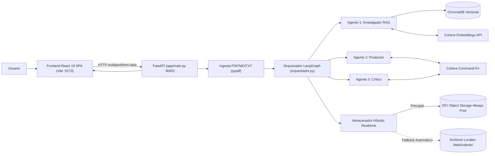
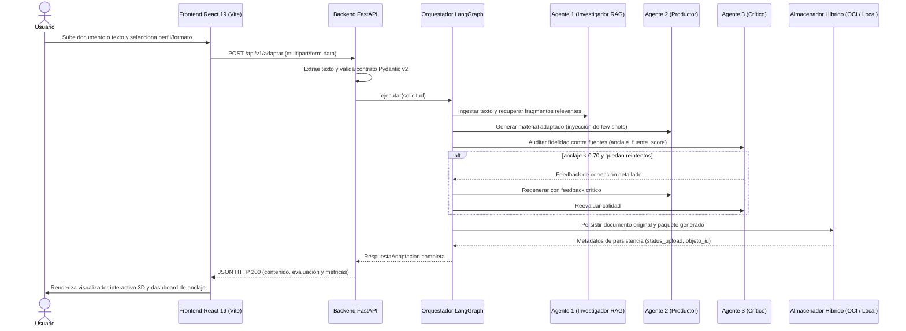

# Arquitectura del Sistema

## Vista General

El sistema **NuevaMente** opera bajo un modelo desacoplado cliente-servidor basado en microservicios, conectando una interfaz web moderna en **React 19 (Vite + TypeScript)** con una API REST en **FastAPI** y un motor de orquestación multi-agente en **LangGraph**:

## Componentes

### 1. Capa de Presentación (Frontend React 19)
- **`frontend/src/App.tsx`**: Orquestador de estado de la aplicación y navegación por vistas (Ingesta, Cargando/Procesando, Visualización y Métricas).
- **`frontend/src/components/Stepper/`**: Indicador visual interactivo de las 3 etapas pedagógicas.
- **`frontend/src/components/IngestView/`**: Formulario drag-and-drop para subida de archivos (.pdf, .md, .txt) o ingreso de texto manual, con selectores canónicos sincronizados con el backend.
- **`frontend/src/components/ViewerView/`**: Visualizadores interactivos especializados para cada uno de los 5 formatos pedagógicos (Flashcards 3D con efecto flip, Quiz interactivo con feedback razonado, Tutorial con pasos y advertencias, TL;DR estructurado y Guion de video).
- **`frontend/src/components/MetricsView/`**: Dashboard de evaluación de calidad, fidelidad RAG (`anclaje_fuente_score`), métricas de tiempo y estado de persistencia OCI.
- **`frontend/src/services/api.ts`**: Cliente HTTP basado en Axios configurado contra `http://localhost:8000` con manejo de multipart/form-data y fallbacks.

### 2. Capa de Servicios y API REST (Backend FastAPI)
- **`backend/app/main.py`**: Configuración de `FastAPI`, `CORSMiddleware` para puertos `5173` y `8000`, endpoints canónicos (`/health`, `/api/v1/config/opciones`, `/api/v1/adaptar`, `/api/v1/paquetes`) y singleton del orquestador.
- **`backend/app/core/ingestion.py`**: Extractor multi-formato para PDFs (limpieza de cabeceras y paginación vía `pypdf`), Markdown y TXT.
- **`backend/app/core/schemas.py`**: Contratos de datos estrictos en Pydantic v2 para los 5 formatos pedagógicos, solicitudes, respuestas y evaluaciones de anclaje.
- **`backend/app/core/config.py`**: Configuración centralizada y resolución tolerante de variables de entorno (`COHERE_*`, `OCI_*`, `AGENTE1_*`).

### 3. Capa de Inteligencia Multi-Agente (LangGraph)
- **`backend/app/orquestador.py`**: Grafo de ejecución determinista con ciclo de feedback reflexivo:
  - **Nodo RAG**: Indexación y recuperación contextual.
  - **Nodo Redacción**: Producción pedagógica con inyección de few-shots por formato.
  - **Nodo Crítica**: Fact-checking contra fuentes y cálculo de `anclaje_fuente_score`.
  - **Decisión / Bucle**: Aprobación directa si `anclaje >= 0.70`, o feedback correctivo con hasta `MAX_RETRIES = 2`.
  - **Nodo Persistir**: Persistencia híbrida mediante `almacenador_resiliente`.

### 4. Capa de Persistencia y Almacenamiento
- **ChromaDB**: Base vectorial local persistente (`data/chroma/` o `./chroma_db`) con métrica de similitud coseno (`cosine`).
- **OCI Object Storage Always Free (`backend/app/storage/oci_client.py`)**: Cliente oficial SDK (`oci.object_storage.UploadManager`) que persiste documentos originales en `documentos-originales/` y paquetes estructurados en `contenidos-generados/`.
- **Almacenamiento Local (`backend/app/storage/local_storage.py`)**: Respaldo automático transparente en `data/outputs/` si OCI está fuera de línea o sin credenciales configuradas.

## Flujo de Adaptación End-to-End

