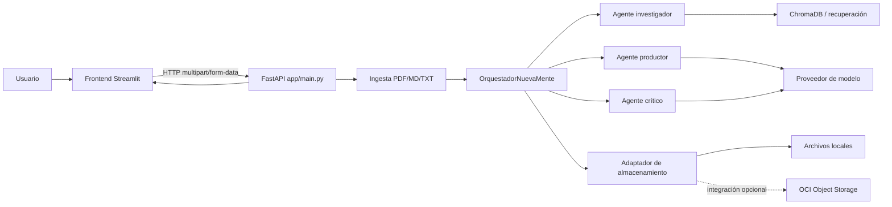
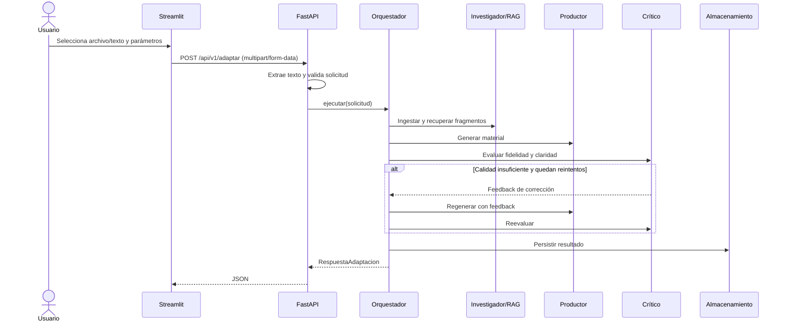

# Arquitectura del sistema

## Vista general

El repositorio separa una interfaz Streamlit, una API FastAPI y un motor de adaptación educativa con agentes. El flujo principal recibe texto/documento, lo valida, lo indexa/consulta, genera contenido, lo evalúa y persiste el resultado.

## Componentes
- **`backend/app/main.py`**: crea `FastAPI`, configura CORS, define endpoints y obtiene un singleton del orquestador.
- **`backend/app/orquestador.py`**: flujo LangGraph principal: ingesta/indexación, recuperación, redacción, crítica, finalización y persistencia; incorpora rutas de error, reintentos y métricas.
- **`backend/app/agentes/agente1_investigador.py`**: búsqueda y gestión de fragmentos para contexto.
- **`backend/app/agentes/agente2_productor.py`**: generación del paquete educativo a partir del contexto y parámetros.
- **`backend/app/agentes/agente3_critico.py`**: evalúa el anclaje del contenido y la claridad pedagógica.
- **`backend/app/core/ingestion.py`**: extrae texto de PDF, Markdown y TXT; guarda los bytes recibidos bajo `data/documents`.
- **`backend/app/core/rag_pipeline.py`**: segmentación de texto, embeddings y almacenamiento/consulta Chroma.
- **`backend/app/core/schemas.py`**: contratos Pydantic, normalización de opciones y validación de estructuras.
- **`backend/app/core/config.py`**: configuración del orquestador basado en Cohere.
- **`backend/app/storage/local_storage.py`**: persistencia local que simula la estructura de OCI.
- **`backend/app/storage/oci_client.py`**: cliente OCI real, condicionado a configuración y credenciales.
- **Frontend**: `streamlit_app.py` presenta la UI y `api_client.py` encapsula llamadas HTTP.

## Flujo de adaptación

## Límites de la arquitectura
No se encontró una base de datos relacional ni un esquema de tablas. Chroma actúa como índice vectorial persistente. El cliente OCI existe, pero el modo efectivo depende de variables y del adaptador elegido al construir el orquestador. Los documentos y paquetes locales se guardan en el sistema de archivos.
