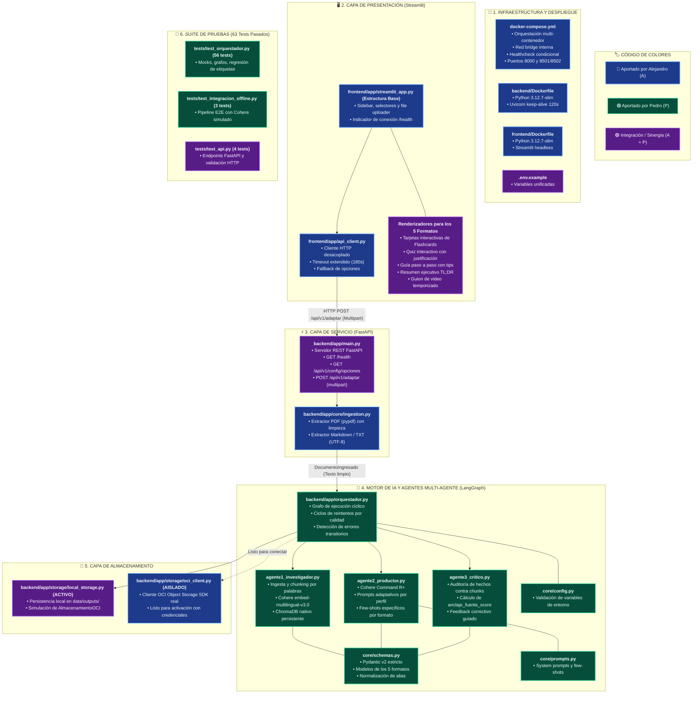

# Arquitectura y Mapa de Integración: Alejandro (A) vs. Pedro (P)

Este documento detalla la trazabilidad técnica de cada archivo y subsistema en la integración de **NuevaMente**, identificando qué parte fue aportada por **Alejandro (A)**, qué parte por **Pedro (P)**, y cuáles corresponden a la **Sinergia de Integración (A + P)**.

---

## 🗺️ Diagrama de Autoría y Flujo de Datos

---

## 📋 Matriz Detallada de Componentes

| Subcutis / Componente | Archivo / Ruta | Autoría Principal | Responsabilidad / Descripción |
| :--- | :--- | :---: | :--- |
| **Orquestación Docker** | [docker-compose.yml](file:///c:/Users/gdq_1/Documents/Gabotech/Ia_NovaMind/G10-LATAM-equipo10NovaMind/docker-compose.yml) | **Alejandro (A)** | Red bridge, dependencia con healthcheck, mapeo de volúmenes y puertos (8000, 8501/8502). |
| **Imágenes Docker** | `backend/Dockerfile` / `frontend/Dockerfile` | **Alejandro (A)** | Configuración multi-etapa con **Python 3.12.7-slim**. |
| **Extracción de Documentos** | [backend/app/core/ingestion.py](file:///c:/Users/gdq_1/Documents/Gabotech/Ia_NovaMind/G10-LATAM-equipo10NovaMind/backend/app/core/ingestion.py) | **Alejandro (A)** | Ingesta binaria de PDFs con `pypdf` (limpieza de encabezados repetidos) y archivos Markdown/TXT. |
| **Cliente OCI Real** | [backend/app/storage/oci_client.py](file:///c:/Users/gdq_1/Documents/Gabotech/Ia_NovaMind/G10-LATAM-equipo10NovaMind/backend/app/storage/oci_client.py) | **Alejandro (A)** | Conexión con Oracle Cloud Object Storage SDK (`oci`) para subir documentos y JSON generados. |
| **Cliente HTTP Frontend** | [frontend/app/api_client.py](file:///c:/Users/gdq_1/Documents/Gabotech/Ia_NovaMind/G10-LATAM-equipo10NovaMind/frontend/app/api_client.py) | **Alejandro (A)** | Envío multipart por HTTP con `requests`, manejo de errores y timeout de 180s. |
| **UI Base Streamlit** | [frontend/app/streamlit_app.py](file:///c:/Users/gdq_1/Documents/Gabotech/Ia_NovaMind/G10-LATAM-equipo10NovaMind/frontend/app/streamlit_app.py) | **Alejandro (A)** | Estructura de barra lateral, subida de archivos, estados de carga y tarjeta de salud `/health`. |
| **Orquestador LangGraph** | [backend/app/orquestador.py](file:///c:/Users/gdq_1/Documents/Gabotech/Ia_NovaMind/G10-LATAM-equipo10NovaMind/backend/app/orquestador.py) | **Pedro (P)** | Grafo de estados, reintentos guiados por feedback y contratos `Protocol`. |
| **Agente 1: Investigador RAG** | [backend/app/agentes/agente1_investigador.py](file:///c:/Users/gdq_1/Documents/Gabotech/Ia_NovaMind/G10-LATAM-equipo10NovaMind/backend/app/agentes/agente1_investigador.py) | **Pedro (P)** | Chunking con solapamiento, embeddings multilingües de Cohere y base vectorial ChromaDB nativa. |
| **Agente 2: Productor** | [backend/app/agentes/agente2_productor.py](file:///c:/Users/gdq_1/Documents/Gabotech/Ia_NovaMind/G10-LATAM-equipo10NovaMind/backend/app/agentes/agente2_productor.py) | **Pedro (P)** | Adaptación pedagógica con Cohere Command R+, few-shots específicos por formato y salida estructurada. |
| **Agente 3: Crítico** | [backend/app/agentes/agente3_critico.py](file:///c:/Users/gdq_1/Documents/Gabotech/Ia_NovaMind/G10-LATAM-equipo10NovaMind/backend/app/agentes/agente3_critico.py) | **Pedro (P)** | Fact-checking matemático de afirmaciones contra fuentes y cálculo de `anclaje_fuente_score`. |
| **Contratos y Esquemas Pydantic** | [backend/app/core/schemas.py](file:///c:/Users/gdq_1/Documents/Gabotech/Ia_NovaMind/G10-LATAM-equipo10NovaMind/backend/app/core/schemas.py) | **Pedro (P)** | Modelos Pydantic v2 de los 5 formatos pedagógicos con normalización de alias del brief. |
| **Plantillas de Prompts** | [backend/app/core/prompts.py](file:///c:/Users/gdq_1/Documents/Gabotech/Ia_NovaMind/G10-LATAM-equipo10NovaMind/backend/app/core/prompts.py) | **Pedro (P)** | Prompts de sistema y ejemplos de transformación few-shot por cada formato. |
| **Suite de Tests (59 tests)** | `tests/test_orquestador.py` / `test_integracion_offline.py` | **Pedro (P)** | Pruebas deterministas sin costo de API para validar el 100% de la lógica de agentes. |
| **API REST FastAPI** | [backend/app/main.py](file:///c:/Users/gdq_1/Documents/Gabotech/Ia_NovaMind/G10-LATAM-equipo10NovaMind/backend/app/main.py) | **Sinergia (A + P)** | Estructura web de Alejandro exponiendo el orquestador y los esquemas de Pedro. |
| **Maqueta de Almacenamiento Local** | [backend/app/storage/local_storage.py](file:///c:/Users/gdq_1/Documents/Gabotech/Ia_NovaMind/G10-LATAM-equipo10NovaMind/backend/app/storage/local_storage.py) | **Sinergia (A + P)** | Persistencia en `data/outputs/` cumpliendo el contrato `Almacenador` de Pedro. |
| **Renderizadores Visuales de Formatos** | `frontend/app/streamlit_app.py` (componentes) | **Sinergia (A + P)** | Componentes Streamlit para dibujar interactivamente los 5 esquemas ricos de Pedro. |
| **Pruebas de la API** | [backend/tests/test_api.py](file:///c:/Users/gdq_1/Documents/Gabotech/Ia_NovaMind/G10-LATAM-equipo10NovaMind/backend/tests/test_api.py) | **Sinergia (A + P)** | 4 tests automatizados que validan los endpoints de FastAPI con TestClient. |
