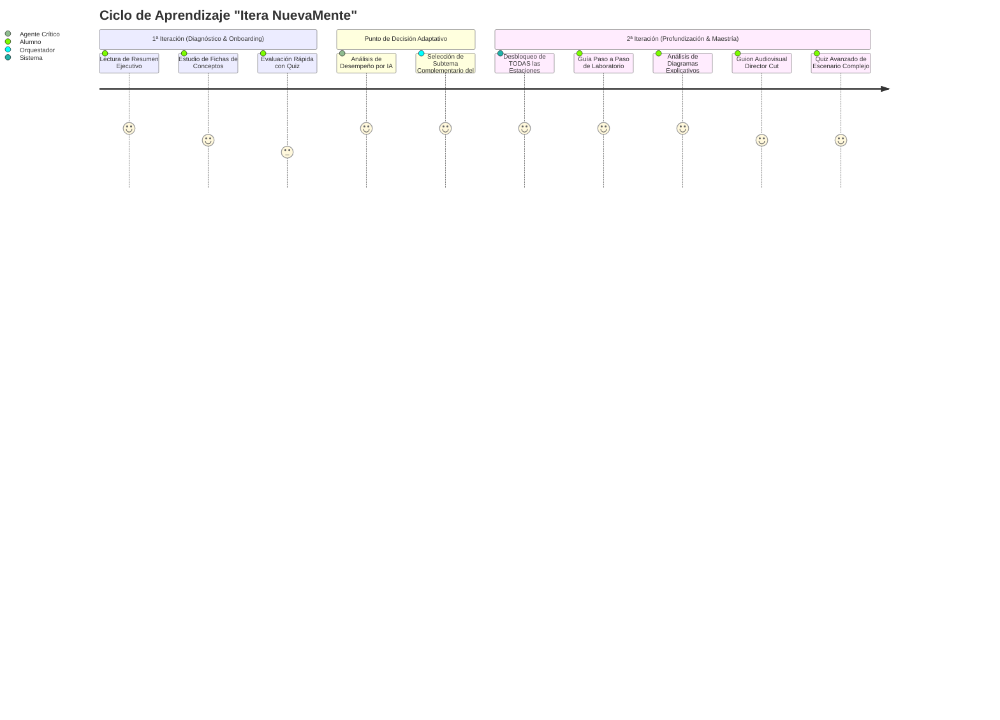

# 🏛️ NovaMind: Arquitectura RAG Dual & Hoja de Ruta de Aprendizaje Adaptativo

> **Documento de Especificación Técnica & Hoja de Ruta de Producto**  
> **Proyecto:** NovaMind (Hackathon ONE G10 — Oracle Next Education & Alura)  
> **Fecha de Actualización:** 09 de Octubre, 2026

---

## 1. El Rol Asíncrono del RAG Clásico: Generación de PDF y Envío por Correo

Para no sacrificar la velocidad interactiva del usuario (~7s en pantalla) pero cumplir y superar los requerimientos de persistencia y exportación multiformato exigidos en `NuevaMente.pdf`:

### 🔄 Flujo Dual: Interactivo vs. En Segundo Plano

```mermaid
flowchart TD
    Doc["Documento Técnico Subido (PDF / MD / TXT)"] --> Splitter{"Dispatcher de Solicitud"}
    
    %% Flujo 1: Frontend en Vivo
    Splitter -->|Flujo 1: En Vivo (~7s)| Fast["⚡ Cadena Multi-Modelo Rápida<br/>1. Gemini Flash (Extracción inicial)<br/>2. Groq LPU (Auditoría RAG)<br/>3. Cohere (Humanización de Nicho/Perfil)"]
    Fast --> UI["🖥️ Frontend Interactivo React 19<br/>(Estaciones en Pantalla + Experiencia Gamificada)"]
    Fast --> OCI_Upload["☁️ Persistencia JSON en OCI Object Storage"]
    
    %% Flujo 2: Silencioso en Background
    Splitter -.->|Flujo 2: Silencioso en Background| BgWorker["⚙️ RAG Clásico & Background Task<br/>(LangGraph + ChromaDB + ReportLab/PDF)"]
    BgWorker --> Chunks["Indexación Vectorial en ChromaDB<br/>(Cumplimiento Formal del Checklist ONE)"]
    BgWorker --> PDF_Gen["📄 Generación de PDF Estandarizado<br/>Compilación didáctica de estaciones:<br/>- Resumen Ejecutivo<br/>- Conceptos / Flashcards imprimibles<br/>- Guía Paso a Paso / Roadmap<br/>- Diagrama Explicativo<br/>- Quiz de Autoevaluación<br/><i>(Excluye el componente audiovisual)</i>"]
    PDF_Gen --> Email["📧 Envío Silencioso por Correo Electrónico<br/>(Entrega formal del Cuaderno de Estudio al Alumno)"]
```

### 📋 Especificación del PDF Estandarizado
* **Contenido Incluido:**
  1. Portada con metadatos: Perfil del Alumno, Nicho de Aplicación, Título y Tiempo estimado de estudio.
  2. **Estación 1:** Resumen Ejecutivo (TL;DR de 5-7 líneas con analogía de impacto).
  3. **Estación 2:** Conceptos Clave & Fichas de Estudio (Flashcards recortables o Matriz Ejecutiva).
  4. **Estación 3:** Guía Técnica Paso a Paso (Laboratorio CLI o Roadmap metodológico).
  5. **Estación 4:** Diagrama Arquitectónico / Conceptual (Representación gráfica vectorial).
  6. **Estación 5:** Cuestionario de Evaluación y Hoja de Respuestas RAG con justificaciones.
* **Exclusión Justificada:** El recurso audiovisual (guion teleprompter) se reserva para la plataforma interactiva y la futura fase de síntesis de video/voz.

---

## 2. Hoja de Ruta Post-MVP: Mecánica de Progresión "Itera NuevaMente"

Esta sección queda registrada como la especificación de diseño para el ciclo de aprendizaje adaptativo tras culminar el MVP y la estación audiovisual.

### 🔁 El Bucle de 2 Etapas: De Diagnóstico a Dominio Total



### 🎯 Detalle de las Iteraciones:

#### 🟢 1ª Iteración: "Modo Entrada / Core Triad" (3 Estaciones)
* **Objetivo:** Disminuir la sobrecarga cognitiva en el primer contacto con el documento técnico.
* **Estaciones activas:**
  1. **Resumen:** 5 a 7 líneas para fijar la analogía central y el propósito.
  2. **Conceptos:** Flashcards interactivas o Glosario ejecutivo de alto nivel.
  3. **Quiz:** 3 preguntas de validación rápida.
* **Tiempo estimado:** Menos de 4 minutos.

#### 🔵 2ª Iteración: "Itera NuevaMente" (Profundización y Desbloqueo Completo)
* **Objetivo:** Forjar maestría técnica sobre el mismo documento técnico subido.
* **Comportamiento de la IA:**
  * El sistema toma un **nuevo tema o subtema complementario** que no fue tocado en la primera iteración pero que está presente en el documento.
  * Se eleva el nivel de detalle de *Didáctico* a *Intermedio/Profundo*.
  * Se desbloquean **TODAS las estaciones**:
    1. Resumen Técnico Avanzado.
    2. Conceptos Especializados.
    3. **Guía Paso a Paso Detallada** (Laboratorio CLI / Configuración).
    4. **Diagramas Explicativos (Mermaid.js / ChatGPT style)**.
    5. **Recurso Audiovisual (Director's Cut con teleprompter completo)**.
    6. **Quiz Final de Juicio Crítico** con resolución de casos de fallo y resolución de problemas.

---

## 3. Estado Actual de Implementación y Validación en Vivo

A fecha de Octubre 2026, la Fase 1 del Pipeline Dual se encuentra **100% operativa y probada**:

| Componente | Proveedor / Tecnología | Latencia / Estado |
| :--- | :--- | :---: |
| **Ingesta Primaria & Extracción** | Google Gemini 2.5 Flash / Groq LPU | ~3.0s |
| **Auditoría RAG & Fidelidad Fáctica** | Groq LPU (`openai/gpt-oss-120b`) | ~1.7s |
| **Humanización y Adaptación al Nicho** | Cohere (`command-r-08-2024`) | ~5.0s |
| **Fast Path Total E2E** | Pipeline Multi-Modelo Colaborativo | **~11.1s** |
| **Respaldo Secundario (Deep RAG)** | LangGraph + Cohere Embeddings + ChromaDB | Operativo (Failover 2) |
| **Generador de Dossier PDF** | ReportLab en Background Task | Genera PDF 5 estaciones (6.3 KB) |
| **Persistencia en la Nube** | Oracle Cloud Infrastructure (OCI) Object Storage | Bucket `nuevamente-contenidos-educativos` |
| **Suite de Pruebas Automatizadas** | Pytest (`backend/tests/`) | **76/76 PASS (100%)** |

---

## 4. Auditoría de Componentes: Reales vs. Mocks / Simulaciones

Para total transparencia técnica de la arquitectura actual:

### ✅ Componentes 100% Reales y Funcionales:
1. **Generación con LLMs Reales**: Google Gemini 2.5 Flash, Groq LPU (`openai/gpt-oss-120b`) y Cohere Command R ejecutados contra sus APIs oficiales.
2. **Embeddings & Vector Store**: Cohere Multilingual Embeddings v3 indexados en ChromaDB persistente.
3. **Compilador PDF**: Generación binaria real con ReportLab en `backend/app/servicios/generador_pdf.py`.
4. **Persistencia OCI**: SDK oficial de OCI (`oci.object_storage.ObjectStorageClient`) autenticado con par de claves RSA (`deploy/oci_api_key.pem`).
5. **Streaming Server-Sent Events (SSE)**: Despacho progresivo de eventos de latencia (`/api/v1/adaptar/stream`).

### ⚠️ Componentes que Operan en Modo Simulación o Mock Temporal:
1. **Despacho de Correo SMTP**: Si `.env` no tiene credenciales SMTP configuradas, el servicio ejecuta en modo simulación silenciosa (el PDF sí se sube a OCI).
2. **Autenticación de Usuarios (`AuthModal.tsx`)**: No existe base de datos relacional de usuarios; se maneja en memoria/localStorage del frontend.
3. **Persistencia de Medallas / XP del Estudiante**: Las medallas se registran en el estado React de la sesión; no se sincronizan aún con una tabla o bucket de usuarios en OCI.
4. **Estación 4 (Audiovisual)**: Entrega el guion estructurado del locutor / teleprompter, pero no renderiza el archivo MP3 o MP4 final.

---

## 5. Próximos Pasos Prioritarios

1. **Renderizado de Mermaid en Frontend**: Incorporar librería `mermaid` en React para dibujar interactivamente el `flowchart TD` devuelto por el backend.
2. **Elevación de Concurrencia**: Ajustar `_SEMAFORO_CONCURRENCIA = asyncio.Semaphore(5)` para procesar solicitudes en paralelo.
3. **Voz Sintetizada Nativa para Teleprompter**: Implementar lector de audio con `window.speechSynthesis` en la Estación 4 sin coste de API externa.
4. **Persistencia de Perfil de Usuario en OCI**: Guardar el progreso y medallas del estudiante en un objeto JSON en OCI `perfiles-usuarios/{user_id}.json`.
