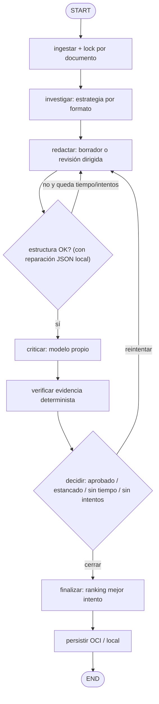

# Plan detallado: mejora de la orquestación multi-agente (NuevaMente)

> Este documento es solo un plan: no se tocó ni se escribió código.
> Rama objetivo: `integracion`. Cada fase termina con `py_compile` y 65/65 tests (más los nuevos), `npm run build` si cambia el frontend, y registro en `HISTORIAL_PROBLEMAS_Y_SOLUCIONES.md` (problemas #30 en adelante).

## Decisiones tomadas (según tus respuestas)

| Tema | Decisión |
|---|---|
| Cohere | Clave **Trial**: minimizar llamadas. Aprox. 20 chat/min y ~1.000 llamadas/mes; **confirmar en el dashboard**. |
| Modelo del Crítico | Configurable y separado del Productor |
| `MOCK_CRITICO` / `FALLBACK_CRITICO` | Solo para dev/test: se restringen |
| Alcance | Backend + frontend compatible + LangSmith opcional |
| Restricción dura | **Timeout de Cloudflare a los 90 s** |

---

## 1. Diagnóstico (hallazgos en el código actual)

### 🔴 Críticos

| # | Hallazgo | Dónde | Impacto |
|---|---|---|---|
| H1 | El endpoint es `async def` pero llama a `orquestador.ejecutar()`, que es **síncrono y bloqueante** | [main.py:L123-L199](file:///c:/Users/gdq_1/Documents/Gabotech/Ia_NovaMind/G10-LATAM-equipo10NovamindA/G10-LATAM-equipo10NovaMind/backend/app/main.py#L123-L199) | Bloquea el event loop: durante una generación, `/health` y las demás solicitudes se congelan |
| H2 | No hay presupuesto de tiempo global. Peor caso: 3 × (redactar + criticar) = 6 chat, cada una con hasta 3 reintentos de tenacity y esperas de hasta 15 s | [orquestador.py:L413-L433](file:///c:/Users/gdq_1/Documents/Gabotech/Ia_NovaMind/G10-LATAM-equipo10NovamindA/G10-LATAM-equipo10NovaMind/backend/app/orquestador.py#L413-L433), [config.py:L109-L111](file:///c:/Users/gdq_1/Documents/Gabotech/Ia_NovaMind/G10-LATAM-equipo10NovamindA/G10-LATAM-equipo10NovaMind/backend/app/core/config.py#L109-L111) | Supera los 90 s → **error 524 de Cloudflare**. El backend termina igual y gasta cuota, pero el usuario no recibe nada |
| H3 | Con clave Trial, reintentar un 429 con backoff de 1-15 s no sirve: la ventana es por minuto (o la cuota es mensual) | `es_error_transitorio` [L160-L184](file:///c:/Users/gdq_1/Documents/Gabotech/Ia_NovaMind/G10-LATAM-equipo10NovamindA/G10-LATAM-equipo10NovaMind/backend/app/orquestador.py#L160-L184) | Se pierde tiempo y cuota. Dos usuarios a la vez pueden agotar el límite |
| H4 | Una evaluación inventada (score 1.0, `chunk-001`) termina como `status="exito"` sin que nadie lo note | [agente3_critico.py:L57, L68-L84, L152-L155](file:///c:/Users/gdq_1/Documents/Gabotech/Ia_NovaMind/G10-LATAM-equipo10NovamindA/G10-LATAM-equipo10NovaMind/backend/app/agentes/agente3_critico.py#L57-L155) | Rompe la promesa de auditoría de fidelidad frente al jurado |

### 🟠 Contratos y robustez

| # | Hallazgo | Dónde |
|---|---|---|
| H5 | El `Protocol Critico` declara `evaluar(contenido, fragmentos)`, pero el nodo lo llama con 3 argumentos (`parametros`) | [orquestador.py:L105-L106](file:///c:/Users/gdq_1/Documents/Gabotech/Ia_NovaMind/G10-LATAM-equipo10NovamindA/G10-LATAM-equipo10NovaMind/backend/app/orquestador.py#L105-L106) vs [L665-L671](file:///c:/Users/gdq_1/Documents/Gabotech/Ia_NovaMind/G10-LATAM-equipo10NovamindA/G10-LATAM-equipo10NovaMind/backend/app/orquestador.py#L665-L671) |
| H6 | `crear_orquestador` le pasa `cfg.cohere_model` al Crítico, así que se ignora su default `command-r-08-2024`. El mismo modelo se evalúa a sí mismo (sesgo de autoevaluación) | [orquestador.py:L960-L961](file:///c:/Users/gdq_1/Documents/Gabotech/Ia_NovaMind/G10-LATAM-equipo10NovamindA/G10-LATAM-equipo10NovaMind/backend/app/orquestador.py#L960-L961) |
| H7 | El Productor lanza `ValueError` para todo: "sin chunks", JSON inválido y esquema inválido. El orquestador trata cualquier `ValueError` como fallo "blando" y **gasta reintentos** aunque el error no se pueda arreglar reintentando | [agente2_productor.py:L135-L208](file:///c:/Users/gdq_1/Documents/Gabotech/Ia_NovaMind/G10-LATAM-equipo10NovamindA/G10-LATAM-equipo10NovaMind/backend/app/agentes/agente2_productor.py#L135-L208), [orquestador.py:L584](file:///c:/Users/gdq_1/Documents/Gabotech/Ia_NovaMind/G10-LATAM-equipo10NovamindA/G10-LATAM-equipo10NovaMind/backend/app/orquestador.py#L584) |
| H8 | `os.environ["COHERE_API_KEY"]` lanza `KeyError` y `respuesta.message.content[0].text` es frágil. El Crítico sí extrae el texto de forma robusta | [agente2_productor.py:L107-L109, L163](file:///c:/Users/gdq_1/Documents/Gabotech/Ia_NovaMind/G10-LATAM-equipo10NovamindA/G10-LATAM-equipo10NovaMind/backend/app/agentes/agente2_productor.py#L107-L163) |
| H9 | Nadie comprueba que `chunk_id_evidencia` del Crítico sea uno de los chunks recibidos: el LLM puede inventar evidencia | [schemas.py:L291-L323](file:///c:/Users/gdq_1/Documents/Gabotech/Ia_NovaMind/G10-LATAM-equipo10NovamindA/G10-LATAM-equipo10NovaMind/backend/app/core/schemas.py#L291-L323) |
| H10 | Si el Crítico devuelve JSON inválido una sola vez, todo termina en `ERROR_CRITICO` (sin reparación local) | [agente3_critico.py:L144-L158](file:///c:/Users/gdq_1/Documents/Gabotech/Ia_NovaMind/G10-LATAM-equipo10NovamindA/G10-LATAM-equipo10NovaMind/backend/app/agentes/agente3_critico.py#L144-L158) |
| H11 | `ParametrosGeneracion` se arma dos veces (en redactar y en criticar), con riesgo de que diverjan | [orquestador.py:L564-L570, L656-L662](file:///c:/Users/gdq_1/Documents/Gabotech/Ia_NovaMind/G10-LATAM-equipo10NovamindA/G10-LATAM-equipo10NovaMind/backend/app/orquestador.py#L564-L662) |

### 🟡 Calidad del ciclo de feedback y de la recuperación

| # | Hallazgo |
|---|---|
| H12 | En cada reintento el Productor **regenera desde cero**, sin ver su borrador anterior. Puede corregir un error e introducir otros nuevos (regresión) |
| H13 | El "mejor intento" se elige solo por score (`>`). Ignora la claridad y en caso de empate gana el primero ([L702](file:///c:/Users/gdq_1/Documents/Gabotech/Ia_NovaMind/G10-LATAM-equipo10NovamindA/G10-LATAM-equipo10NovaMind/backend/app/orquestador.py#L702-L705)) |
| H14 | No hay parada temprana por estancamiento: si el score no mejora, igual se consume el siguiente intento |
| H15 | El feedback de estructura se concatena con el del Crítico y puede crecer de un intento a otro ([L588-L594](file:///c:/Users/gdq_1/Documents/Gabotech/Ia_NovaMind/G10-LATAM-equipo10NovamindA/G10-LATAM-equipo10NovaMind/backend/app/orquestador.py#L588-L594)) |
| H16 | Se hace una única consulta semántica (`tema_consulta` o título) con `top_k=6`. Para Resumen y Guion importa más cubrir todo el documento que la similitud |
| H17 | `min_score=0.60` puede ser alto para `embed-multilingual-v3.0`. Si es así, se cae seguido al respaldo "sin umbral". **Hay que medirlo** |
| H18 | `fuentes_utilizadas` lista **todos** los chunks, no los que el Productor citó de verdad |
| H19 | Dos solicitudes simultáneas con el mismo documento pueden indexarlo en paralelo (carrera en `contar_chunks` y luego `ingerir`) |

---

## 2. Propuestas contra el timeout de 90 s de Cloudflare

> [!IMPORTANT]
> Cloudflare corta la conexión si el origen tarda en responder. Hay que atacar el problema en dos niveles: **(a)** que el pipeline nunca supere un presupuesto de tiempo y **(b)** que la conexión HTTP no dependa de lo que dure el pipeline.

| Opción | Cómo funciona | Pros | Contras | Recomendación |
|---|---|---|---|---|
| **A. Presupuesto de tiempo interno** | `deadline` configurable (p. ej. `PRESUPUESTO_SEGUNDOS=70`). Antes de cada reintento, el orquestador estima si alcanza el tiempo y, si no, entrega el mejor intento con advertencia (`motivo_finalizacion="presupuesto_tiempo"`) | Sin cambios de contrato y bajo riesgo | No garantiza nada si una sola llamada se cuelga | **Obligatoria** (red de seguridad) |
| **B. Timeouts por llamada** | `timeout` en el cliente Cohere (p. ej. 25 s por chat) y espera total de tenacity limitada por el deadline restante | Evita llamadas colgadas | — | **Obligatoria** |
| **C. Trabajo asíncrono + polling** | `POST /api/v1/adaptar/trabajos` responde `202 {trabajo_id}` al instante. El frontend consulta `GET /api/v1/trabajos/{id}` cada 2-3 s y recibe `{estado, etapa, progreso, respuesta}` | Inmune a Cloudflare, simple y sin Redis (store en memoria con TTL) | El store en memoria exige **1 worker de uvicorn** y se pierde si el proceso se reinicia | **Recomendada** |
| **D. SSE (progreso en vivo)** | `GET /api/v1/trabajos/{id}/eventos` emite eventos por nodo usando `grafo.stream()`, con heartbeat cada 15 s | UX rica: muestra "investigando → redactando → auditando (intento 2)" | `EventSource` solo hace GET, por eso va encima de C. Hay que verificar que el proxy no haga buffering | Mejora opcional sobre C |
| **E. Separar la ingesta** | `POST /documentos` (embeber) por un lado y `POST /adaptar` con `documento_id` por otro | Saca los embeddings del camino crítico | Cambia el flujo de la UI | Opcional |
| **F. Mantener `/adaptar` síncrono** | Se conserva por compatibilidad (tests y clientes actuales), pero ejecutándose en threadpool y con el deadline de A | Compatibilidad total | Sigue expuesto a Cloudflare si A falla | Mantener como *legacy* |

**Sinergia con la clave Trial:** el executor de trabajos de la opción C puede tener `max_workers=1-2` y funcionar como **cola**. Así se limita la concurrencia hacia Cohere y se evitan los 429 de forma natural.

---

## 3. Plan por fases

### Fase 0 — Línea base y medición (antes de cambiar comportamiento)
1. Correr 5 escenarios reales (uno por formato) y registrar por nodo: duración, cantidad de llamadas chat/embed, intentos y motivo de cierre.
2. Medir cuántas veces se usa el respaldo "sin umbral" del Agente 1 (para validar H17).
3. Medir p50/p95 de cada llamada chat del Productor y del Crítico. Con eso se fijan `PRESUPUESTO_SEGUNDOS` y los timeouts por llamada.
4. **Entregable:** tabla de tiempos en `historial_progreso/` (archivo local).

### Fase 1 — Timeout y event loop 🔴 (prioridad máxima, bajo riesgo)
| Paso | Cambio propuesto | Archivos |
|---|---|---|
| 1.1 | Ejecutar `orquestador.ejecutar` fuera del event loop (threadpool) **o** declarar el endpoint como `def` | `main.py` |
| 1.2 | Agregar `deadline` al estado (`inicio + PRESUPUESTO_SEGUNDOS`). `_ruta_tras_criticar` y `_ruta_tras_redactar` consultan el tiempo restante antes de volver a `redactar` | `orquestador.py`, `config.py` |
| 1.3 | Timeout por llamada en los clientes Cohere (productor y crítico), configurable | `agente2`, `agente3`, `config.py` |
| 1.4 | Tenacity: `stop_after_delay` atado al deadline restante. Ante un 429, respetar `Retry-After` si existe y **no reintentar si la espera supera el tiempo restante** | `orquestador.py` |
| 1.5 | Agregar `motivo_finalizacion` (`aprobado` / `reintentos_agotados` / `presupuesto_tiempo` / `estancamiento` / `error`) a `MetricasOrquestacion` como campo **opcional** (compatible) | `schemas.py` |
| 1.6 | Implementar la opción C (trabajos + polling). El `/adaptar` síncrono se mantiene | `main.py` (nuevo módulo `app/trabajos.py`) |

### Fase 2 — Contratos y robustez entre agentes 🟠
| Paso | Cambio propuesto | Resuelve |
|---|---|---|
| 2.1 | Corregir el `Protocol Critico` para que incluya `parametros: ParametrosGeneracion` | H5 |
| 2.2 | Nueva variable `COHERE_MODEL_CRITICO` en `Config` (default distinto del productor y más rápido, p. ej. `command-r-08-2024`). `crear_orquestador` la usa | H6 |
| 2.3 | Mover `MOCK_CRITICO`/`FALLBACK_CRITICO` a `Config` y agregar `ENTORNO` (`dev`/`test`/`prod`). En `prod` fallan al arrancar | H4 |
| 2.4 | Marcar la evaluación sintética (`evaluacion_sintetica=True`). El orquestador **nunca** devuelve `"exito"` con ella: como máximo `exito_con_advertencias` | H4 |
| 2.5 | Taxonomía de errores del Productor: `ProductorSinContexto` (no reintentable), `SalidaNoJSON` / `EsquemaInvalido` (reintentables) y errores del SDK (los clasifica tenacity). El orquestador solo reintenta los reintentables | H7 |
| 2.6 | Productor: API key vía `Config` (sin `KeyError`) y extracción de texto robusta, compartida con el Crítico (helper común) | H8 |
| 2.7 | **Verificación determinista de evidencia:** si `respaldada=True` y `chunk_id_evidencia` no está entre los chunks entregados, se pasa a `False` con el comentario "evidencia inexistente". No cuesta llamadas | H9 |
| 2.8 | Reparar el JSON localmente antes de fallar (quitar fences, extraer el primer `{...}` balanceado) en Productor y Crítico. Evita gastar un reintento LLM | H10 |
| 2.9 | Calcular `ParametrosGeneracion` una sola vez y guardarlo en `EstadoFlujo` | H11 |

### Fase 3 — Ciclo de feedback más eficiente (clave con clave Trial) 🟡
| Paso | Cambio propuesto | Resuelve |
|---|---|---|
| 3.1 | **Revisión dirigida:** en el reintento, el Productor recibe su **borrador anterior (JSON)** junto con la lista de afirmaciones a eliminar o reescribir, y se le pide editar, no regenerar | H12 |
| 3.2 | **Ranking del mejor intento** con la tupla `(aprobado, score, claridad Alta>Media>Baja, más reciente)` | H13 |
| 3.3 | **Parada temprana por estancamiento:** si `score_n - score_{n-1} < 0.05`, terminar | H14 |
| 3.4 | Feedback acotado y **no acumulativo**: solo las correcciones del último intento, deduplicadas y con un tope de caracteres | H15 |
| 3.5 | Bajar la temperatura en los reintentos (0.3 → 0.15 → 0.0) | Estabilidad |
| 3.6 | **Perfil Trial:** `MAX_REDACCION_RETRIES=1` por defecto (como máximo 4 llamadas chat por solicitud) | H3 |
| 3.7 | (Opcional) Pedir al Productor `chunk_ids` citados por item. `fuentes_utilizadas` = chunks realmente citados | H18 |

### Fase 4 — Recuperación (Agente 1) 🟡
| Paso | Cambio propuesto | Costo en llamadas |
|---|---|---|
| 4.1 | Recalibrar `MIN_SCORE_RETRIEVAL` con los datos de la Fase 0 | 0 |
| 4.2 | **Estrategia por formato:** Resumen y Guion usan "cobertura" (MMR o chunks repartidos por `posicion` en todo el documento). Quiz, Flashcards y Tutorial siguen con similitud | 0 (las embeddings ya están en Chroma) |
| 4.3 | Lock por `documento_id` en la ingesta (evita la carrera) | 0 |
| 4.4 | (Opcional) En un reintento con muchas afirmaciones no respaldadas, ampliar `top_k` sin re-embeber la consulta | 0 |

### Fase 5 — Observabilidad
| Paso | Cambio propuesto |
|---|---|
| 5.1 | Campos **opcionales** en `MetricasOrquestacion`: `duracion_por_etapa`, `llamadas_llm`, `modelo_productor`, `modelo_critico`, `motivo_finalizacion`, `evaluacion_sintetica` |
| 5.2 | `trace_id` por solicitud, propagado a todos los logs |
| 5.3 | **LangSmith opt-in** por variables de entorno. LangGraph traza los nodos automáticamente; las llamadas Cohere se envuelven con `@traceable`. Apagado en tests |

> [!WARNING]
> LangSmith envía los documentos y prompts a un SaaS externo. Esto choca con la regla de confidencialidad del proyecto si se procesan documentos sensibles. Propuesta: activarlo solo en dev y con la variable vacía por defecto en `.env.example`.

### Fase 6 — Frontend (cambios compatibles)
1. `services/api.ts`: crear el trabajo y luego hacer polling (y SSE en una segunda etapa), con fallback al `/adaptar` síncrono.
2. Barra de progreso por etapa en `IngestView` / `App.tsx`.
3. `MetricsView`: mostrar `motivo_finalizacion`, tiempos por etapa, modelos usados y un **badge visible** cuando la evaluación sea sintética.
4. `types/api.ts`: sincronizar los campos opcionales nuevos.

### Fase 7 — Pruebas nuevas (además de las 65 actuales)
- Al agotarse el deadline se entrega el mejor intento con `motivo_finalizacion="presupuesto_tiempo"`.
- Un 429 con espera mayor al tiempo restante no se reintenta.
- `ProductorSinContexto` no consume reintentos.
- Una evidencia con `chunk_id` inexistente se marca como no respaldada.
- El ranking del mejor intento desempata por claridad.
- La parada por estancamiento funciona.
- La evaluación sintética nunca produce `"exito"`, y `ENTORNO=prod` con `MOCK_CRITICO` falla al arrancar.
- Endpoints de trabajos: 202, estados `pendiente`/`en_progreso`/`completado`/`error`, expiración por TTL.
- `/health` responde mientras corre una generación (regresión de H1).

---

## 4. Grafo propuesto



## 5. Presupuesto de llamadas chat por solicitud

| Escenario | Actual | Propuesto (perfil Trial) |
|---|---|---|
| Aprobado al primer intento | 2 | 2 |
| Peor caso sin errores de red | 6 | 4 |
| Peor caso con reintentos de tenacity | hasta 18 | acotado por el deadline (en la práctica ≤ 5) |
| JSON inválido del Crítico | `ERROR_CRITICO` | reparación local (0 llamadas extra) |

## 6. Orden sugerido de entrega

1. **Fase 1 (1.1–1.5)** + **2.3/2.4**: elimina el 524 y el falso "éxito". Bajo riesgo.
2. **1.6 (polling)** + **Fase 6.1–6.2**.
3. **Fase 2** restante + **Fase 3**.
4. **Fase 4**, **Fase 5** y SSE.

---

## 7. Preguntas abiertas (información que no está en el contexto)

1. **Workers de uvicorn en OCI:** ¿cuántos se usan? El store de trabajos en memoria requiere 1 worker (o pasar a un store en archivo/SQLite).
2. **Cloudflare:** ¿el timeout es de su plan (100 s Free/Pro) o hay una regla propia de 90 s? ¿Hay algún proxy intermedio (nginx) con `proxy_read_timeout` que también deba ajustarse para SSE?
3. **Modelo del Crítico:** ¿lo dejamos en `command-r-08-2024` o prefieren otro (más rápido o más estricto)?
4. **LangSmith:** ¿se puede enviar contenido de documentos a un SaaS externo, o solo metadatos?
5. **Fuentes por item (3.7):** cambia el prompt y el contrato interno del Productor. ¿Lo incluimos en esta iteración?


##

# 🚀 Plan de Implementación Técnico: Orquestación de Agentes, SSE y Resiliencia (NuevaMente)

> **Documento de Arquitectura y Plan de Ejecución (Solo Backend)**  
> **Rama de trabajo:** `integracion`  
> **Restricciones clave asumidas:**
> - VM 1 (Backend): OCI Always Free `VM.Standard.E2.1.Micro` (1 vCPU, 1 GB RAM) → **1 solo worker de Uvicorn**.
> - Proxy / Red: VM 2 Nginx (`proxy_read_timeout 180s`) + Cloudflare Free Tier (**Timeout estricto de 100s / Error 524**).
> - Agente Crítico: Arquitectura multi-proveedor desacoplada con **Google Gemini (gemini-2.5-flash)** como primario (~2s de latencia) y fallback en cascada a **Groq (qwen/qwen3.8-27b)** y **Cohere (command-r-08-2024)**.
> - Observabilidad: LangSmith con **sanitización total de documentos** (`LANGCHAIN_HIDE_INPUTS=true`).
> - Frontend: En desarrollo v2; se preserva compatibilidad 100% con endpoints REST síncronos mientras se añade el canal SSE.
> - Roadmap audiovisual / masivo: Arquitectura desacoplada lista para **ElevenLabs** y entrega progresiva de recursos.

---

## 📑 Índice de Contenidos

1. [Topología y Flujo de Comunicación (Nginx + Cloudflare + SSE)](#1-topología-y-flujo-de-comunicación)
2. [Configuración de Nginx en VM 2 (Soporte SSE Ininterrumpido)](#2-configuración-de-nginx-en-vm-2)
3. [Estrategia de Memoria y Concurrencia (VM 1 - 1 GB RAM)](#3-estrategia-de-memoria-y-concurrencia)
4. [Diseño del Protocolo SSE y Heartbeat Anti-Cloudflare (100s)](#4-diseño-del-protocolo-sse-y-heartbeat)
5. [Desacople del Event Loop en FastAPI](#5-desacople-del-event-loop-en-fastapi)
6. [Agente Crítico Multi-Proveedor (Fábrica, Gemini 2.5 Flash y Cascada de Resiliencia)](#6-agente-crítico-multi-proveedor-fábrica-gemini-25-flash-y-cascada-de-resiliencia)
7. [Configuración Segura de LangSmith (Metadata Only)](#7-configuración-segura-de-langsmith)
8. [Ranking de Tiempos de Producción y Diseño Modular (Generación Masiva y ElevenLabs)](#8-ranking-de-tiempos-de-producción-y-diseño-modular-generación-masiva-y-elevenlabs)
9. [Archivos a Modificar y Snippets de Código Exactos](#9-archivos-a-modificar-y-snippets-de-código)
10. [Plan de Pruebas y Despliegue](#10-plan-de-pruebas-y-despliegue)

---

## 1. Topología y Flujo de Comunicación

```
[ Cliente (React 19) ]
         │
         │ (HTTPS / SSE Streaming)
         ▼
[ Cloudflare (Free Tier - Timeout 100s) ]
         │
         │ (HTTP proxy)
         ▼
[ VM 2: climasmart-bems-vm (Nginx Reverse Proxy) ]
         │  - proxy_buffering off;
         │  - proxy_read_timeout 180s;
         │  - proxy_set_header Connection '';
         ▼
[ VM 1: n8n-vm (OCI Micro 1 vCPU / 1GB RAM) ]
         └── FastAPI (:8000) [1 Worker Uvicorn]
               ├── Semaphore(1) [Límite concurrencia RAM/Trial]
               ├── asyncio.to_thread / Background Task
               └── LangGraph Orquestador
                     ├── Agente 1 (ChromaDB Local + Cohere Embed)
                     ├── Agente 2 (Command A - Productor)
                     ├── Agente 3 (Command-R-08-2024 - Crítico)
                     └── OCI Object Storage / Local Storage
```

---

## 2. Configuración de Nginx en VM 2

En la VM 2 (`climasmart-bems-vm`), Nginx actúa como terminador o puente intermedio antes de la VM 1. Para que Server-Sent Events (SSE) y las respuestas en streaming funcionen sin que Nginx retenga búferes en memoria (lo que causaría que Cloudflare alcance los 100 segundos sin recibir bytes), la directiva de proxy debe configurarse explícitamente:

### Snippet de configuración Nginx (`/etc/nginx/sites-available/...` o `/etc/nginx/conf.d/...`)

```nginx
location /api/v1/adaptar/stream {
    proxy_pass http://<IP_PRIVADA_VM1>:8000;
    
    # Requisitos Mandatorios para Server-Sent Events (SSE):
    proxy_http_version 1.1;
    proxy_set_header Connection "";
    proxy_set_header Host $host;
    proxy_set_header X-Real-IP $remote_addr;
    proxy_set_header X-Forwarded-For $proxy_add_x_forwarded_for;
    proxy_set_header X-Forwarded-Proto $scheme;

    # Desactivar buffering para transmisión inmediata de paquetes:
    proxy_buffering off;
    proxy_cache off;
    chunked_transfer_encoding on;

    # Timeouts extendidos para streaming:
    proxy_read_timeout 180s;
    proxy_send_timeout 180s;
    proxy_connect_timeout 30s;
}

# Mantener soporte síncrono estándar para endpoints tradicionales
location / {
    proxy_pass http://<IP_PRIVADA_VM1>:8000;
    proxy_http_version 1.1;
    proxy_set_header Host $host;
    proxy_set_header X-Real-IP $remote_addr;
    proxy_set_header X-Forwarded-For $proxy_add_x_forwarded_for;
    proxy_read_timeout 180s;
}
```

---

## 3. Estrategia de Memoria y Concurrencia (VM 1 - 1 GB RAM)

Dado que la VM 1 cuenta con `VM.Standard.E2.1.Micro` (1 vCPU, 1 GB RAM, Linux), ejecutar múltiples procesos disparará el OOM Killer de OCI:
1. **Un solo worker de Uvicorn:** `uvicorn app.main:app --host 0.0.0.0 --port 8000 --workers 1` (~98 MB a 140 MB de RSS con ChromaDB cargado).
2. **Semáforo Asíncrono de Procesamiento:** Implementar un `asyncio.Semaphore(1)` o cola de tareas en memoria. Si entra una segunda solicitud pesada mientras la primera está embebiendo o generando con el LLM:
   - No compite por la única vCPU ni duplica el consumo de ChromaDB.
   - Protege los límites de la clave **Trial de Cohere** (evita ráfagas 429).
   - Informa al cliente vía SSE: `{"evento": "en_cola", "mensaje": "Esperando turno de procesamiento..."}`.
3. **Gestión de ChromaDB:** Mantener `chromadb.PersistentClient` como singleton dentro del proceso.

---

## 4. Diseño del Protocolo SSE y Heartbeat Anti-Cloudflare (100s)

Cloudflare Free Tier cierra cualquier conexión HTTP con el error **524 A timeout occurred** si no recibe un chunk HTTP durante **100 segundos**.

### Mecanismo de Heartbeat Activo:
- Cada **15 segundos**, si ningún agente ha emitido un evento de estado, el generador asíncrono emite un comentario SSE:
  ```text
  : ping - heartbeat anti-timeout\n\n
  ```
- O un evento estructurado:
  ```text
  event: heartbeat
  data: {"timestamp": 1728169200, "tiempo_transcurrido": 15.2, "estado": "procesando"}
  ```
Esto mantiene viva la conexión TCP de Cloudflare de forma indefinida hasta completar el pipeline.

### Catálogo de Eventos SSE:
1. `event: inicio` → Contiene `documento_id`, `tarea_id` y timestamp.
2. `event: paso` → Notifica la etapa del grafo (`ingestar`, `investigar`, `redactar`, `criticar`, `persistir`).
3. `event: heartbeat` → Keepalive cada 15s.
4. `event: recurso_parcial` → (Roadmap masivo) Notifica la finalización de un bloque/item generado.
5. `event: auditoria` → Resultado del Agente Crítico (score de anclaje, observaciones).
6. `event: resultado` → Entrega el `RespuestaAdaptacion` final validado.
7. `event: error` → Detalle amigable estructurado (`ErrorFlujo`).

---

## 5. Desacople del Event Loop en FastAPI

En el archivo actual [backend/app/main.py](file:///c:/Users/gdq_1/Documents/Gabotech/Ia_NovaMind/G10-LATAM-equipo10NovamindA/G10-LATAM-equipo10NovaMind/backend/app/main.py#L123-L199):
```python
# ACTUAL (Problemático):
async def adaptar_contenido(...):
    respuesta = orquestador.ejecutar(solicitud) # <- Bloquea el event loop síncronamente durante 20-50 segundos
```
Cualquier solicitud concurrente a `/health` o a la API queda congelada.

### Solución:
- En `/api/v1/adaptar` (REST síncrono para compatibilidad actual): envolver la ejecución en `await asyncio.to_thread(orquestador.ejecutar, solicitud)`.
- En `/api/v1/adaptar/stream` (Nuevo SSE): usar un generador asíncrono puenteando la cola interna del orquestador mediante `asyncio.Queue` o `LangGraph.astream()`.

---

## 6. Agente Crítico Multi-Proveedor (Fábrica, Gemini 2.5 Flash y Cascada de Resiliencia)

Con base en la auditoría en vivo y las pruebas de los proveedores disponibles, el Agente Crítico se desacopla del Productor para eliminar el sesgo de autoevaluación, garantizar latencias de ~2 segundos y asegurar auditorías auténticas y defendibles ante el jurado.

### A. Patrón Fábrica y Estrategia Configurable vía `.env`
El Agente Crítico implementará una interfaz abstracta desacoplada (`ProveedorCritico`) que permite alternar o combinar proveedores mediante configuración:

```bash
# Variables en .env:
PROVEEDOR_CRITICO=gemini                 # Proveedor primario: gemini | groq | cohere
MODELO_CRITICO=gemini-2.5-flash          # Modelo analítico primario
PROVEEDOR_CRITICO_FALLBACK=groq          # Proveedor secundario en caso de error/cuota
MODELO_CRITICO_FALLBACK=qwen/qwen3.8-27b # Modelo de respaldo rápido (Groq LPU o Cohere)
```

### B. Ventajas del Proveedor Primario: Google Gemini (`gemini-2.5-flash`)
1. **Latencia Excepcional:** Evalúa en **1.5 a 3.0 segundos**, manteniendo la duración total del pipeline en **~12–15 segundos**.
2. **Structured Outputs Nativos (`response_schema`):** El SDK de Google (`google-genai` o `google.generativeai`) garantiza la validación estricta de `EvaluacionCalidad` sin necesidad de regex ni reparación manual de markdown.
3. **Independencia Real:** Rompe el sesgo de autoevaluación (el contenido generado por Cohere es auditado de forma neutral por Gemini).
4. **Cuota Gratuita:** 15 RPM y 1.500 peticiones diarias gratuitas en Google AI Studio.

### C. Cascada de Resiliencia (Multi-Tier Fallback)
Si durante la auditoría el proveedor primario falla (por ejemplo HTTP 429 por límite de tasa o timeout de red):
1. **Nivel 1 (Primario):** Intento con `gemini-2.5-flash`.
2. **Nivel 2 (Fallback Inmediato):** Si Nivel 1 falla, conmuta automáticamente a `groq` (`qwen/qwen3.8-27b`) o `cohere` (`command-r-08-2024`).
3. **Nivel 3 (Degradación Elegante):** Si todos los proveedores LLM fallaran, se emite una respuesta con `status="exito_con_advertencias"` y la advertencia explícita en el JSON, **sin mentir con status="exito"**.

### D. Corrección de Firma del Protocolo Crítico
En [backend/app/orquestador.py](file:///c:/Users/gdq_1/Documents/Gabotech/Ia_NovaMind/G10-LATAM-equipo10NovamindA/G10-LATAM-equipo10NovaMind/backend/app/orquestador.py#L105-L107):
```python
class Critico(Protocol):
    def evaluar(
        self,
        contenido_generado: Any,
        fragmentos: str,
        parametros: ParametrosGeneracion,
    ) -> EvaluacionCalidad: ...
```

### E. Desactivación de Evaluaciones Fantasma en Producción
En [backend/app/agentes/agente3_critico.py](file:///c:/Users/gdq_1/Documents/Gabotech/Ia_NovaMind/G10-LATAM-equipo10NovamindA/G10-LATAM-equipo10NovaMind/backend/app/agentes/agente3_critico.py):
- Si `ENTORNO == "prod"`, `MOCK_CRITICO` y `FALLBACK_CRITICO` deben lanzar excepción de configuración o marcar `evaluacion_sintetica=True`.
- El Orquestador no otorgará `status="exito"` si una evaluación es sintética; marcará `status="exito_con_advertencias"`.

### F. Verificación Determinista de Evidencia
Antes de computar el score del crítico, verificar en código Python que cada `chunk_id_evidencia` citado exista realmente en los `chunks` suministrados por el Agente 1. Si no existe, se clasifica como `respaldada=False` (costo computacional: 0 llamadas de API).

### G. Preservación de Embeddings (Agente 1): Cohere Multilingual v3
* **Decisión:** Se mantiene **Cohere `embed-multilingual-v3.0`** (1024 dimensiones).
* **Justificación técnica:** Ejecuta en **~1.0 s**, no consume memoria RAM en la máquina de 1 GB y evita la necesidad de purgar o reindexar ChromaDB, manteniendo intactas las 65 pruebas automatizadas existentes.

---

## 7. Configuración Segura de LangSmith (Metadata Only)

Para auditar latencias, consumo de tokens y ejecuciones de nodos sin filtrar documentos sensibles o vulnerar las políticas de privacidad del proyecto:

### Variables de entorno (`.env.example` y servidor OCI):
```bash
LANGCHAIN_TRACING_V2=true
LANGCHAIN_ENDPOINT="https://api.smith.langchain.com"
LANGCHAIN_API_KEY="" # Opcional / Opt-in
LANGCHAIN_PROJECT="nuevamente-orquestacion-prod"

# REGLA ESTRICTA DE CONFIDENCIALIDAD:
LANGCHAIN_HIDE_INPUTS=true
LANGCHAIN_HIDE_OUTPUTS=true
```
Con estas dos variables activadas, LangChain/LangGraph omite por completo los payloads de texto (`documento_contenido`, `chunks`, `prompt` y `contenido_adaptado`), reportando únicamente:
- Nombre del nodo (`ingestar`, `investigar`, `redactar`, `criticar`).
- Duración en milisegundos.
- Estado (éxito/error).
- Metadatos del sistema (intentos, modelo utilizado).

---

## 8. Ranking de Tiempos de Producción y Diseño Modular (Generación Masiva y ElevenLabs)

### A. Ranking Técnico de Tiempos de Producción en el Sistema Actual

Analizando el volumen de tokens generados, la carga de auditoría del Agente Crítico y la fricción de validación de esquemas Pydantic:

| Puesto | Formato Pedagógico | Latencia Estimada | Salida (Tokens) | Carga del Crítico | Fricción / Riesgo de Reintento |
| :---: | :--- | :---: | :---: | :---: | :--- |
| **#1** | **Resumen Ejecutivo (TL;DR)** | **15 – 22 s** | ~300 – 450 | Baja (4-6 puntos) | **Mínima** (esquema plano y directo). |
| **#2** | **Flashcards** | **20 – 28 s** | ~450 – 650 | Baja/Media (5-10 tarjetas) | **Baja** (unidades atómicas). |
| **#3** | **Guía Práctica (Tutorial)** | **28 – 38 s** | ~600 – 900 | Media (4-10 pasos procedurales) | **Media** (a veces inventa prerrequisitos). |
| **#4** | **Quiz Interactivo** | **38 – 55 s** *(>65s si reintenta)* | ~800 – 1.200 | Alta (4 opciones × 5-8 preguntas) | **Muy Alta** (discrepancias entre `respuesta_correcta` y `opciones`). |
| **#5** | **Guion de Clase / Video** | **45 – 65 s** *(>75s si reintenta)* | ~1.000 – 1.500 | Muy Alta (narración extensa + visuales) | **Media/Alta** (volumen máximo de tokens e inferencia). |

---

### B. Decisiones de la Iteración Acordadas

1. **Estrategia de Generación Masiva Progresiva:**
   - La emisión hacia el frontend se realizará en estricto orden de menor latencia:
     $$\text{TL;DR} \longrightarrow \text{Flashcards} \longrightarrow \text{Tutorial} \longrightarrow \text{Quiz} \longrightarrow \text{Guion}$$
   - **Beneficio UX:** El usuario visualiza el primer recurso en pantalla en **< 20 segundos**, reduciendo drásticamente la percepción de espera mientras el worker procesa el resto en segundo plano.

2. **Auto-reparación Defensiva del Quiz (`validar_items` en `schemas.py`):**
   - En lugar de disparar una excepción `EstructuraInvalidaError` que fuerce un reintento completo del LLM (consumiendo cuota de Cohere y sumando 25-30s), se implementa un saneamiento determinista en Python:
     - Normalización de prefijos (`"A) Texto"` $\rightarrow$ `"Texto"`).
     - Trim de espacios y puntuación superflua.
     - Coincidencia semántica tolerante entre `respuesta_correcta` y la lista de `opciones`.

3. **Módulo Audiovisual con ElevenLabs (Asíncrono en Segundo Plano):**
   - El texto y la estructura pedagógica se entregan inmediatamente al usuario.
   - La síntesis de voz se procesa en segundo plano sin bloquear la respuesta de texto.
   - Se emite un evento SSE posterior:
     ```text
     event: audio_listo
     data: {"formato": "Guion de Clase / Video", "audio_url": "https://.../audio.mp3", "duracion_segundos": 124}
     ```
   - Si la cuota o conexión de ElevenLabs falla, el recurso educativo principal nunca se ve afectado.

---

## 9. Archivos a Modificar y Snippets de Código Exactos

### 1. `backend/app/core/config.py`
Incorporar configuraciones del Crítico, timeouts y presupuesto de ejecución:

```python
# Modificación en Config (app/core/config.py)
@dataclass(frozen=True)
class Config:
    # --- Cohere ---
    cohere_api_key: Optional[str]
    cohere_model: str
    cohere_model_critico: str          # NUEVO
    embedding_model: str

    # --- Agente 1 (RAG) ---
    chroma_path: str
    collection_name: str
    top_k: int
    min_score_retrieval: float

    # --- Orquestación & Resiliencia ---
    min_anclaje_fuente_score: float
    max_redaccion_retries: int
    api_reintentos: int
    api_espera_base_segundos: float
    presupuesto_tiempo_segundos: float # NUEVO (ej. 75.0s para quedar < 100s de Cloudflare)
    timeout_llamada_llm: float         # NUEVO (ej. 25.0s por request)
    entorno: str                       # NUEVO ('prod', 'dev', 'test')

    @classmethod
    def desde_entorno(cls, cargar_dotenv: bool = True) -> "Config":
        if cargar_dotenv:
            load_dotenv()

        return cls(
            cohere_api_key=os.getenv("COHERE_API_KEY") or None,
            cohere_model=os.getenv("COHERE_MODEL", "command-a-03-2025"),
            cohere_model_critico=os.getenv("COHERE_MODEL_CRITICO", "command-r-08-2024"),
            embedding_model=os.getenv("COHERE_EMBEDDING_MODEL", "embed-multilingual-v3.0"),
            chroma_path=os.getenv("CHROMA_PATH", "./chroma_db"),
            collection_name=os.getenv("CHROMA_COLLECTION_NAME", "nuevamente_documentos"),
            top_k=_leer_int("TOP_K_CHUNKS", 6, 1, 30, nombre_alternativo="TOP_K"),
            min_score_retrieval=_leer_float("MIN_SCORE_RETRIEVAL", 0.60, 0.0, 1.0),
            min_anclaje_fuente_score=_leer_float("MIN_ANCLAJE_FUENTE_SCORE", 0.75, 0.0, 1.0),
            max_redaccion_retries=_leer_int("MAX_REDACCION_RETRIES", 1, 0, 5),
            api_reintentos=_leer_int("API_REINTENTOS", 2, 1, 4),
            api_espera_base_segundos=_leer_float("API_ESPERA_BASE_SEGUNDOS", 1.0, 0.0, 15.0),
            presupuesto_tiempo_segundos=_leer_float("PRESUPUESTO_TIEMPO_SEGUNDOS", 75.0, 10.0, 95.0),
            timeout_llamada_llm=_leer_float("TIMEOUT_LLAMADA_LLM", 25.0, 5.0, 60.0),
            entorno=os.getenv("APP_ENV", "dev").lower(),
        )
```

### 2. `backend/app/agentes/agente3_critico.py`
Corregir inicialización de cliente, timeout y protección contra falsos mocks:

```python
# En app/agentes/agente3_critico.py
class AgenteCriticoContenido:
    def __init__(
        self,
        api_key: str | None = None,
        modelo: str = "command-r-08-2024",
        timeout: float = 25.0,
        permitir_mock: bool = False,
    ):
        self._bypass = (
            permitir_mock and
            os.getenv("MOCK_CRITICO", "false").lower() in ("true", "1", "yes")
        )
        clave = api_key or os.getenv("COHERE_API_KEY")

        if not clave and not self._bypass:
            raise CriticoGenerationError(
                "No existe COHERE_API_KEY en las variables de entorno."
            )

        self._cliente = cohere.ClientV2(api_key=clave, timeout=timeout) if clave else None
        self._modelo = modelo
        self._timeout = timeout
```

### 3. `backend/app/orquestador.py`
1. Actualizar el protocolo `Critico`.
2. Conectar el nuevo parámetro `modelo=cfg.cohere_model_critico` en `crear_orquestador`.
3. Agregar verificación de presupuesto de tiempo antes de cada reintento:

```python
# En app/orquestador.py - Control de Presupuesto en rutas condicionales
def _tiempo_restante(self, estado: EstadoFlujo) -> float:
    inicio = estado.get("inicio", time.perf_counter())
    transcurrido = time.perf_counter() - inicio
    return max(0.0, self._cfg.presupuesto_tiempo_segundos - transcurrido)

def _ruta_tras_criticar(self, estado: EstadoFlujo) -> str:
    if estado.get("error") or estado.get("aprobado"):
        return "finalizar"
    
    # Si queda menos de 20 segundos para el límite de 75s, no arriesgar otro ciclo
    if self._tiempo_restante(estado) < 20.0:
        logger.warning(
            "[orquestador] Presupuesto de tiempo agotándose (restan %.1fs). "
            "Se abortan reintentos y se entrega el mejor resultado.",
            self._tiempo_restante(estado)
        )
        advertencias = list(estado.get("advertencias", []))
        advertencias.append(
            "Se cerró la generación anticipadamente para evitar timeout de red. "
            "Se entrega el mejor borrador obtenido."
        )
        estado["advertencias"] = advertencias
        return "finalizar"

    if estado.get("intentos", 0) < 1 + self._cfg.max_redaccion_retries:
        return "redactar"
    return "finalizar"
```

4. Verificación determinista de chunk IDs citados:

```python
# En app/orquestador.py - Dentro de _nodo_criticar:
chunks_validos = {c.chunk_id for c in estado.get("chunks", [])}
afirmaciones_saneadas = []
for af in evaluacion.afirmaciones:
    if af.respaldada and af.chunk_id_evidencia not in chunks_validos:
        logger.info(
            "Afirmación marcada como respaldada citó chunk desconocido '%s'. Corrigiendo a False.",
            af.chunk_id_evidencia
        )
        afirmaciones_saneadas.append(
            af.model_copy(update={
                "respaldada": False,
                "comentario": f"Evidencia inválida (chunk '{af.chunk_id_evidencia}' no existe en las fuentes)."
            })
        )
    else:
        afirmaciones_saneadas.append(af)

# Recalcular score con las afirmaciones auditadas
evaluacion = evaluacion.model_copy(update={"afirmaciones": afirmaciones_saneadas})
```

### 4. `backend/app/main.py`
1. Desacoplar `/api/v1/adaptar` para no congelar Uvicorn.
2. Añadir `/api/v1/adaptar/stream` con SSE y Heartbeat:

```python
# En app/main.py
import asyncio
import json
from fastapi.responses import StreamingResponse

# Semáforo para 1 sola ejecución pesada concurrente (VM Micro 1GB RAM)
_SEMAFORO_CONCURRENCIA = asyncio.Semaphore(1)

@app.post(
    "/api/v1/adaptar",
    response_model=RespuestaAdaptacion,
    tags=["Adaptación Pedagógica"],
)
async def adaptar_contenido(
    # ... mismos parámetros multipart actuales ...
):
    # 1. Extracción de contenido (igual que el actual)
    # ...
    # 2. Validación Pydantic (igual que el actual)
    # ...
    
    # 3. Ejecución desacoplada del event loop
    orquestador = get_orquestador()
    async with _SEMAFORO_CONCURRENCIA:
        respuesta = await asyncio.to_thread(orquestador.ejecutar, solicitud)
    return respuesta


@app.post(
    "/api/v1/adaptar/stream",
    tags=["Adaptación Pedagógica (Streaming)"],
)
async def adaptar_contenido_stream(
    archivo: Optional[UploadFile] = File(None),
    texto_directo: Optional[str] = Form(None),
    titulo: Optional[str] = Form(None),
    perfil_destinatario: str = Form(...),
    formato_salida: str = Form(...),
    nicho_sector: str = Form("General"),
    nivel_detalle: str = Form("Didáctico"),
    tema_consulta: Optional[str] = Form(None),
):
    """
    Endpoint SSE con Heartbeats cada 15 segundos para inmunidad ante Cloudflare (100s).
    """
    # [Extracción y validación inicial de solicitud]
    # ...
    
    async def generador_eventos():
        cola_eventos = asyncio.Queue()
        
        # Tarea de fondo ejecutando el orquestador
        async def ejecutar_tarea():
            async with _SEMAFORO_CONCURRENCIA:
                # El orquestador puede emitir callbacks a cola_eventos en cada nodo
                await cola_eventos.put({"tipo": "paso", "etapa": "inicio", "mensaje": "Iniciando orquestación..."})
                
                # Ejecutar orquestador en threadpool
                try:
                    res = await asyncio.to_thread(get_orquestador().ejecutar, solicitud)
                    await cola_eventos.put({"tipo": "final", "payload": res.model_dump()})
                except Exception as err:
                    await cola_eventos.put({"tipo": "error", "mensaje": str(err)})
                finally:
                    await cola_eventos.put(None) # Señal de fin
        
        tarea = asyncio.create_task(ejecutar_tarea())
        
        # Bucle de emisión con Heartbeat cada 15s
        while True:
            try:
                evento = await asyncio.wait_for(cola_eventos.get(), timeout=15.0)
                if evento is None:
                    break
                yield f"event: {evento.get('tipo', 'mensaje')}\ndata: {json.dumps(evento, ensure_ascii=False)}\n\n"
            except asyncio.TimeoutError:
                # HEARTBEAT ACTIVO: Mantiene viva la conexión TCP con Cloudflare
                yield f": ping - heartbeat anti-timeout 100s\n\n"
        
        await tarea

    return StreamingResponse(
        generador_eventos(),
        media_type="text/event-stream",
        headers={
            "Cache-Control": "no-cache",
            "Connection": "keep-alive",
            "X-Accel-Buffering": "no", # Desactiva buffer en proxies Nginx automáticos
        },
    )
```

---

## 10. Plan de Pruebas y Despliegue

### Validación Local (Pre-Commit / Pre-Deploy)
1. **Compilación Python 3.12:**
   ```bash
   python -m py_compile backend/app/main.py backend/app/orquestador.py backend/app/core/config.py backend/app/agentes/*.py
   ```
2. **Suite de pruebas existente (pytest):**
   ```bash
   pytest backend/tests/ -v
   ```
   *Criterio:* Los **65 tests actuales deben continuar pasando al 100%**.
3. **Nuevos Tests de Regresión y Resiliencia:**
   - Test de no-bloqueo del event loop (verificar que `/health` responde `200` mientras corre un pipeline simulado).
   - Test de presupuesto de tiempo (forzar latencias artificiales y verificar que corta antes de los 75s entregando el mejor borrador).
   - Test de saneamiento de evidencia en Agente 3.
   - Test de rechazo de evaluación mock en `APP_ENV=prod`.

### Despliegue en Servidores OCI
1. **VM 2 (`climasmart-bems-vm` - Nginx):**
   - Actualizar configuración de Nginx con las directivas `proxy_buffering off;` y `proxy_read_timeout 180s;`.
   - Validar sintaxis: `sudo nginx -t`.
   - Recargar sin downtime: `sudo systemctl reload nginx`.
2. **VM 1 (`n8n-vm` - Backend):**
   - Actualizar repositorio en rama `integracion`.
   - Configurar variables en `.env`:
     ```bash
     COHERE_MODEL_CRITICO=command-r-08-2024
     PRESUPUESTO_TIEMPO_SEGUNDOS=75.0
     APP_ENV=prod
     LANGCHAIN_HIDE_INPUTS=true
     LANGCHAIN_HIDE_OUTPUTS=true
     ```
   - Reiniciar servicio systemd de Uvicorn (1 worker).
   - Verificar consumo de RAM (`htop` o `free -m`) asegurando RSS < 150 MB.
3. **Registro:** Actualizar `historial_progreso/HISTORIAL_PROBLEMAS_Y_SOLUCIONES.md` documentando el problema resuelto #30 (Timeout Cloudflare 100s / Bloqueo Event Loop / Separación Crítico).
